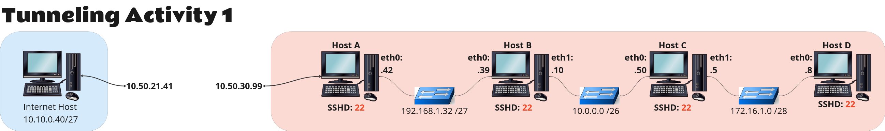
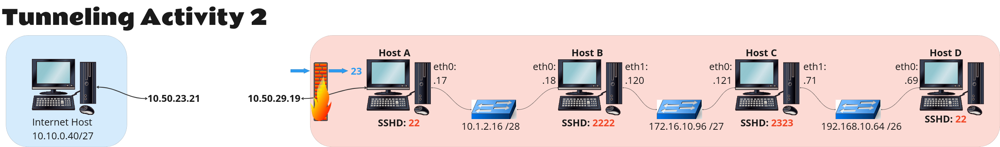
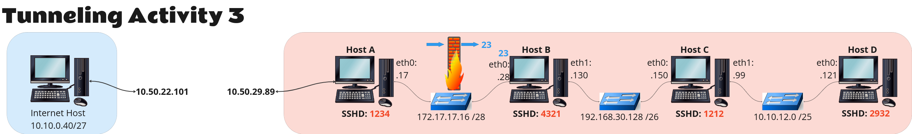
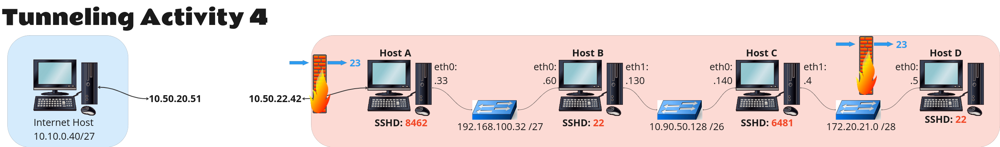

## TUNNELING ACTIVITY 1 ##

 {: style="background-color: white"}

##### Going from Internet Host to Host A and creating a dynamic tunnel on the fly #####

`ssh hostA@10.50.30.99 -p 22 -D 9050`

run proxychain scans and identified Host B with ip 192.168.1.39 sshd 22

##### Create a local tunnel to host B from A #####

`ssh hostA@10.50.30.99 -p 22 (or remove it and as it defaults to 22) -L 1111:192.168.1.39:22`

kill dynamic tunnel, `kill -9 #PID_NO`

##### Create a dynamic tunnel to host B from the Internet Host #####

`ssh hostB@localhost -p 1111 -D 9050`

run proxychain scans and identified host C 10.0.0.50 with port 22

##### Create a local tunnel to host C from B #####

`ssh hostB@localhost -p 1111 (or remove it and as it defaults to 22) -L 2222:10.0.0.50:22`

kill dynamic tunnel, `kill -9 #PID_NO`

##### Create a dynamic tunnel to host C from the Internet Host #####

`ssh hostC@localhost -p 2222 -D 9050`

run proxychain scans and identified host D 172.16.1.8 with port 22

##### Create a local tunnel to host D from C #####

`ssh hostC@localhost -p 2222 (or remove it and as it defaults to 22) -L 3333:172.16.1.8:22`

##### Create a dynamic tunnel to host D from the Internet Host #####

`ssh hostD@localhost -p 3333 -D 9050`

## TUNNELING ACTIVITY 2 ##

{: style="background-color: white"}

##### Telnet to Host A #####

`telnet hostA@10.50.23.19`

##### Create a Reverse tunnel to host the internet host from A #####

`ssh internet_host@10.50.23.21 -p 22 -R 1111:localhost:22`

##### Create a dynamic tunnel to host A from the Internet Host #####

`ssh hostA@localhost -p 1111 -D 9050`

run proxychain scans and identified Host B with ip 10.1.2.18 sshd 2222

##### Create A local tunnel to B from A #####

`ssh hostA@localhost -p 1111 -L 4444:10.1.2.18:2222`

kill dynamic tunnel, `kill -9 #PID_NO`

##### Create a dynamic tunnel to host B from the Internet Host #####

`ssh hostB@localhost -p 4444 -D 9050`

run proxychain scans and identified Host C with ip 172.16.10.121 sshd 2323

##### Create A local tunnel to C from B #####

`ssh hostB@localhost -p 4444 -L 5555:172.16.10.121:2323`

kill dynamic tunnel, `kill -9 #PID_NO`

`ssh hostC@localhost -p 5555 -D 9050`

run proxychain scans and identified Host D with ip 192.168.10.69 sshd 22

##### Create A local tunnel to D from C #####

`ssh hostC@localhost -p 5555 -L 6666:192.168.10.69:22`

`ssh hostD@localhost -p 6666 -D 9050`

kill dynamic tunnel, `kill -9 #PID_NO`

## TUNNELING ACTIVITY 3 ##

{: style="background-color: white"}

##### Create a dynamic tunnel to the internet host #####

`ssh userA@10.50.29.89 -p 1234 -D 9050`

##### Create a local tunnel to 172.17.17.28 Host B #####

`ssh userA@10.50.29.89 -p 1234 -L 1111:172.17.17.28:23` 

##### Telnet to Host B #####

`telnet localhost 1111`

##### Create a remote tunnel back to Host A #####

`ssh userA@172.17.17.17 -p 1234(authenticating_back_to_A) -R 2222(created_port_on_A):localhost(host_B):4321(ssh_port_on_B)` Ran on B back to A

##### Create a local tunnel to Host B #####

`ssh userA@10.50.29.89 -p 1234 -L 3333:localhost:2222` Ran on the internet host. Authenticate back to A to target local_host_2222 on A

##### Create a dynamic tunnel to Host B #####

`ssh userB@localhost -p 3333 -D 9050`

Ran proxychains and got 1212 and 192.168.30.150

##### Host B from C ---->  Lets get to Host C from B, create a local tunnel to host B #####

`ssh userB@localhost -p 3333 (this_gets_me_to_B) -L 4444:192.168.30.150:1212`

##### A dynamic tunnel to C #####

`ssh userC@localhost -p 4444 -D 9050` Creating a dynamic tunnel to C, ssh to C 

Ran proxychains and discovered host D with port 2932 and ip address 10.10.12.121

##### We are going to c and creating a local tunnel to D #####

` ssh userC@localhost -p 4444 -L 5555:10.10.12.121:2932 `

##### Create a dynamic tunnel to D #####

`ssh userD@localhost -p 5555 -D 9050`

## TUNNELING ACTIVITY 4 ##

{: style="background-color: white"}

##### Telnet directly to A #####

`telnet hostA@10.50.22.42`

##### Let's remote back to A #####

`ssh me@10.50.20.51 -p 22 (-p 22 is optional) -R 1111:localhost:8462 `

##### From the internet host we create a dynamic channel to host A #####

`ssh hostA@localhost -p 1111 -D 9050`

Ran proxy chains and discovered B with port 22 and ip address 192.168.100.60 
Kill proxychains 

##### Let's create a local channel from host A to to host B #####

`ssh hostA@localhost -p 1111 -L 2222:192.168.100.60:22`

##### A dynamic tunnel to B from internet host #####

`ssh hostB@localhost -p 2222 -D 9050`

Ran proxychains and discovered host C with port 6481 and ip address 10.90.50.140

##### We are going to C from B and creating a local tunnel. #####

`ssh hostB@localhost -p 2222 -L 3333:10.90.50.140:6481`

Kill proxychains 

##### From the internet host let's create a dynamic channel to host C #####

`ssh hostC@localhost -p 3333 -D 9050`

Ran proxy chains and discovered D with port 22 and ip address 172.20.21.5

##### Create a local channel to host D. This creates a localhost that you can now use to telnet #####

`ssh hostC@localhost -p 3333 -L 4444:172.20.21.5:23`

##### Let's telnet to D #####

`telnet localhost 4444`

##### Let's create a remote tunnel back to C from D #####
`ssh hostC@172.20.21.4 -p 6481 -R 5555:localhost:22`

##### A local tunnel from internet host #####

`ssh hostC@localhost(this_refers_to_internet_host) -p 3333 -L 6666:localhost(this_refers_to_c):5555`

Kill proxychains 

##### Let's create a dynamic tunnel to D #####

`ssh hostD@localhost -p 6666 -D 9050`

Ran our proxy chains... 

