## Reverse Enginnering 2 ##

1. Situation: Various teams have extracted binaries from Donovian development networks. Analyze the given binaries to find weaknesses and create signatures.

Provided: compiled executable: (entry.exe) source code: (entry.c) Task: Run the executable with expected input and retrieve success message. Method: disassemble the executable and follow the program’s execution to discover its f unctionality, and expected input.

Ensure that before you move on from this challenge that you have fully understood what you have done to disassemble and reverse engineer this binary and how it is related to the provided source code.

What is the key for this binary?

Step 1: Create a Dynamic tunnel to Jumpbox `ssh student@10.50.33.231 - D 9050 –NT`

Step 2: Scan the Donovian Ip to see what ports are open `proxychains nmap -sT -Pn 192.168.28.111`

Step 3: wget the http server since port 80 is open and also from the lonTermStorage directory `proxychains wget -r http://192.168.28.111/longTermStorage`

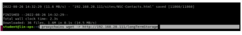

Step 4: longtermStorage has entry.c and entry.exe files on it

Step 5: Download Win SCP on the Windows box---open the win SCP application

Login with your lin ops IP: 10.50.40.1

User: student

Pass: password

Copy the file from linu box(right side) to the windows (left side)

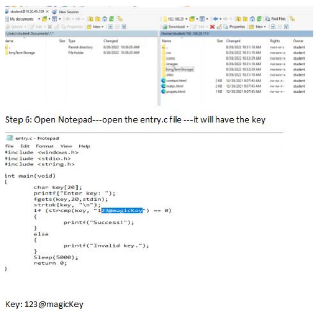

Key: 123@magicKey

2. Basic Algorithm

a. Situation: Various teams have extracted binaries from Donovian development networks. Analyze the given binaries to find weaknesses and create signatures.

b. Provided: compiled executable: (basic1.exe) Task: Run the executable and retrieve a successful message using the binary's key. Method: disassemble the executable and follow the program’s execution to discover its functionality and expected input.

c. Add the value of all of the keys together. What is the MD5 hash of this sum?

Step 1: Open Ghidra and import the file to Ghidra

Step 2: Open .exe on cmd and run the file with random input

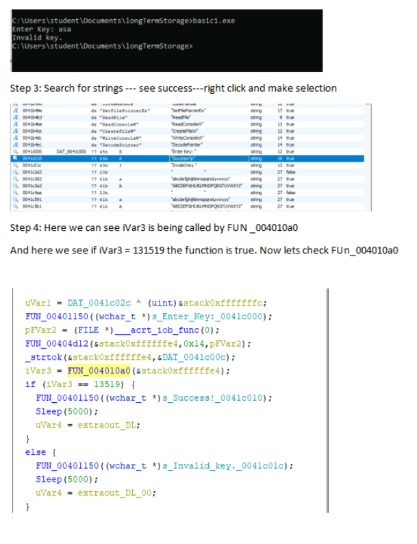

Step 5:

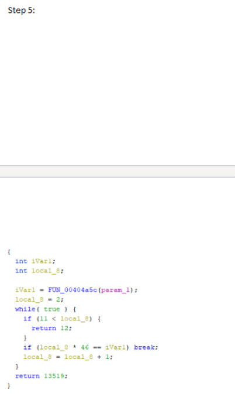

Here, the while loop says if 11 <local_8 = 2 this condition is meet the loop continues

Now looking at if statement and going through the iteration until the condition is meet which is 11<local_8

So we iterate to 11

92 + 138 + 184 + 230 + 276 + 322 + 368 + 414 + 460 +506 = 2990

to get the answer do the: ` echo "2990" | md5sum `

3. Provided: compiled executable: (sdst3.exe) Task: Run the executable with expected input and retrieve success message. Method: disassemble the executable and follow the program’s execution to discover its functionality, and expected input.

Enter the complete name of one of the items used to determine the success of the binary's execution.

ENV11

4. Situation: Various teams have extracted binaries from Donovian development networks. Analyze the given binaries to find weaknesses and create signatures.

Provided: compiled executable: (sdst.exe) Task: Run the executable with expected input and retrieve success message. Method: disassemble the executable and follow the program’s execution to discover its functionality, and expected input.

What is the MD5 hash of the key (specifically the value and not location) that the program required?

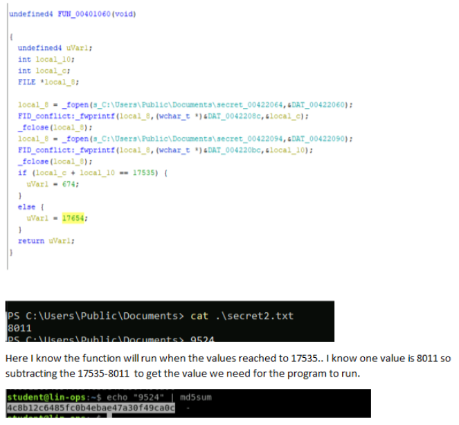

5. Situation: Various teams have extracted binaries from Donovian development networks. Analyze the given binaries to find weaknesses and create signatures.

Provided: compiled executable: (sdst2.exe) Task: Run the executable with expected input and retrieve success message. Method: disassemble the executable and follow the program’s execution to discover its f unctionality, and expected input.

Show the instructor how you solved this to be awarded points.

Ra the program and found the success----followed the function

Here on the RegOpenKeyExA---- function is saying that the value will be on the MS registry

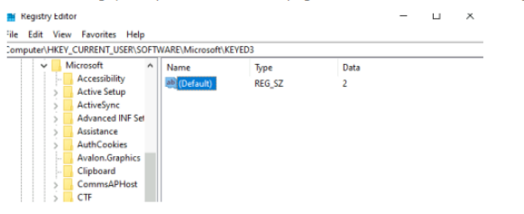

Here, registry was 0 initially

RegQueryValueExA function = This function retrieves the type and data for a specified value name associated with an open registry key

So, we know local_208 value is 0 because the registry default was 0

Now, to see the local_210 value which is located at publci documents and sec

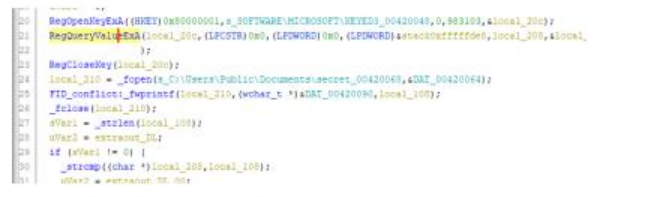

Clicking the file path gives the file name which is secret3.txt

Opening the file is empty as well.

Now, we know for the function to be run the sVar1 should not be be 0

The strcmp() compares two strings character by character. If the strings are equal, the function returns 0.

Local_108 value is at the secrret3.txt which we know is empty as well.

Now, for this function to run value of sVar1 cannot be 0. because the sVar1=_strlen(local_108) is looking for the string length. Reason the function does not run if value is 0 is because it skips the function. So for function to run value os sVar1 which is string length should not be 0.

We can input any numberas var1 but it has to match the registry number as sVar1 is comparing it with registry number

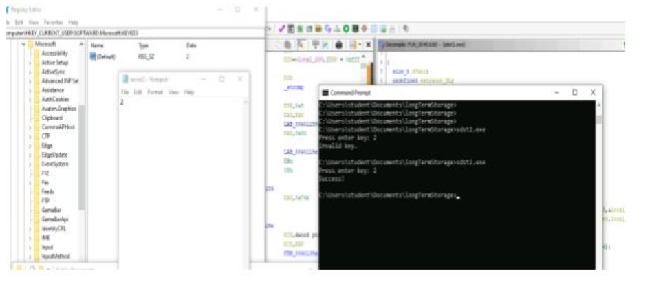

6. Situation:

Various teams have extracted binaries from Donovian development networks. Analyze the given binaries to find weaknesses and create signatures. Provided: compiled executable: (sdst3.exe) Task: Run the executable with expected input and retrieve success message. Method: disassemble the executable and follow the program’s execution to discover its functionality, and expected input.

What value determines successful execution of the binary?

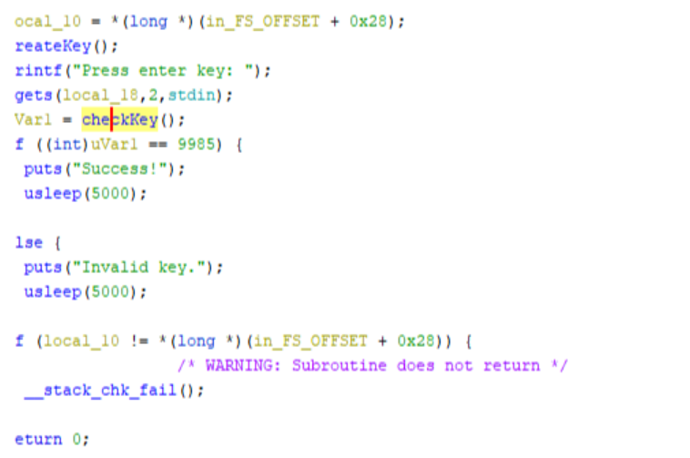

For this function to run uVar1 == 9985, here uVar1 = checkKey() which is our function. Following thr checkkey() function

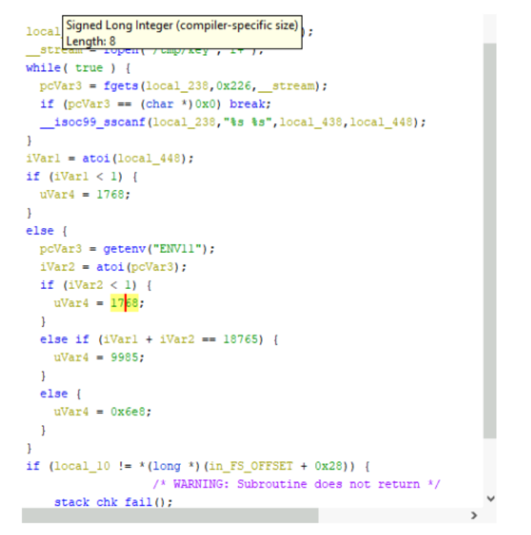

The C library function int atoi(const char *str) converts the string argument str to an integer (type int).

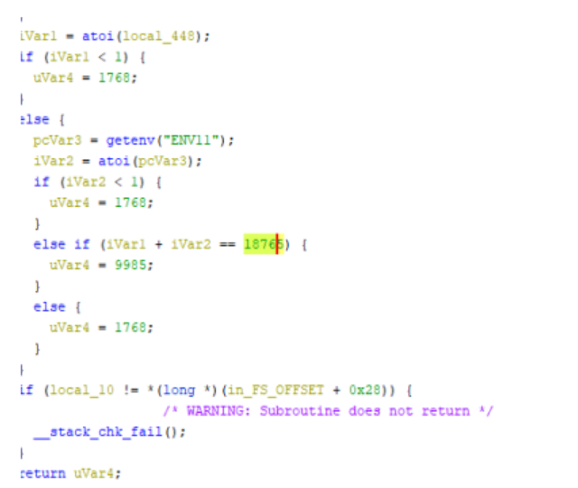

Here variable 1 and 2 determines if uVar4= 9985

7. Situation: Various teams have extracted binaries from Donovian development networks. Analyze the given binaries to find weaknesses and create signatures.

Provided: compiled executable: (patching.exe) Task: Provide a patched executable that displays a "Successful" message for every key entered Method: Utilize RE toolset provided to patch additional or modified functionality to the binary.

Use your imagination to show the patched file to the instructor and they will give you the points if you have completed the challenge successfully

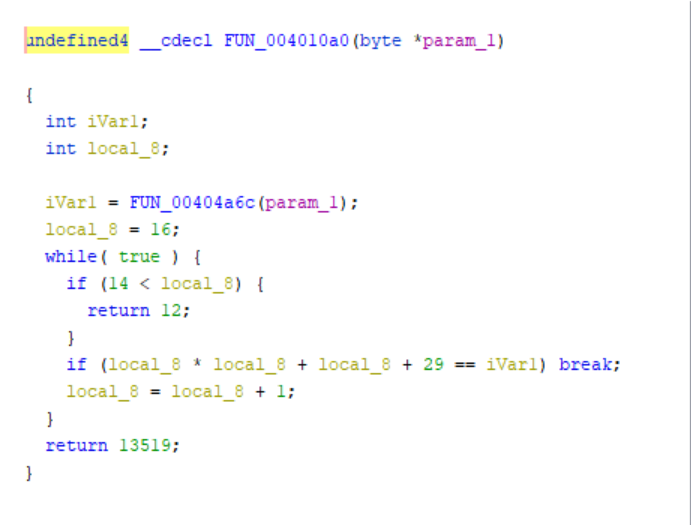
