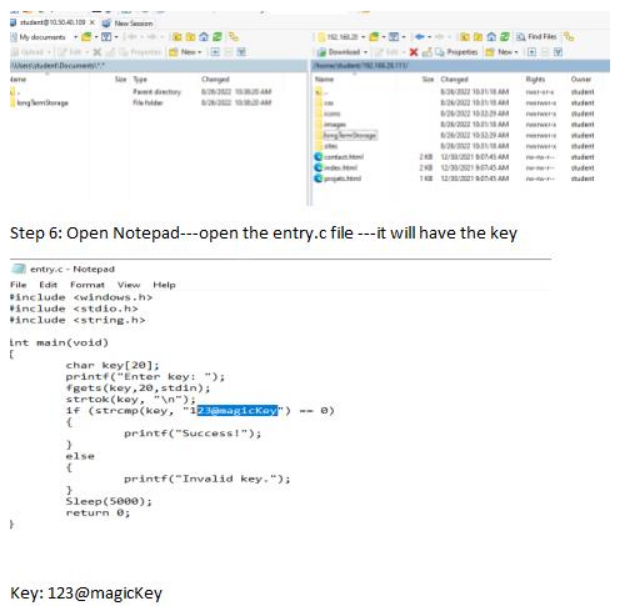

## Reverse Enginnering 2 ##

1. Situation: Various teams have extracted binaries from Donovian development networks. Analyze the given binaries to find weaknesses and create signatures.

Provided: compiled executable: (entry.exe) source code: (entry.c) Task: Run the executable with expected input and retrieve success message. Method: disassemble the executable and follow the program’s execution to discover its f unctionality, and expected input.

Ensure that before you move on from this challenge that you have fully understood what you have done to disassemble and reverse engineer this binary and how it is related to the provided source code.

What is the key for this binary?

Step 1: Create a Dynamic tunnel to Jumpbox `ssh student@10.50.33.231 - D 9050 –NT`

Step 2: Scan the Donovian Ip to see what ports are open `proxychains nmap -sT -Pn 192.168.28.111`

Step 3: wget the http server since port 80 is open and also from the lonTermStorage directory `proxychains wget -r http://192.168.28.111/longTermStorage`

Step 4: longtermStorage has entry.c and entry.exe files on it

Step 5: Download Win SCP on the Windows box---open the win SCP application

Login with your lin ops IP: 10.50.40.1

User: student

Pass: password

Copy the file from linu box(right side) to the windows (left side)

Key: 123@magicKey

2. Basic Algorithm

a. Situation: Various teams have extracted binaries from Donovian development networks. Analyze the given binaries to find weaknesses and create signatures.

b. Provided: compiled executable: (basic1.exe) Task: Run the executable and retrieve a successful message using the binary's key. Method: disassemble the executable and follow the program’s execution to discover its functionality and expected input.

c. Add the value of all of the keys together. What is the MD5 hash of this sum?

Step 1: Open Ghidra and import the file to Ghidra

Step 2: Open .exe on cmd and run the file with random input